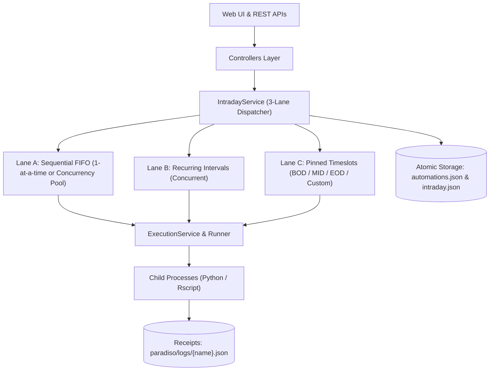

# Paradiso

> **Bank-Grade Decoupled Multi-Lane Daemon Scheduling Engine & Observability Platform**  
> *Certified 100% Audit-Passing Baseline (128/128 Unit Tests — 100% Pass Rate, 0 Active Defects)*

---

## 1. Overview

**Paradiso** is a thread-safe, bank-grade daemon scheduling engine and dark-cathedral Web UI built for enterprise financial, regulatory, and operational report pipelines. It orchestrates automated workloads across three distinct scheduling lanes with strict state machine window yielding, process supervision, atomic storage persistence, and zero tolerance for unverified batch executions.



---

## 2. The 3-Lane Scheduling Architecture

| Lane | Scheduling Model | Concurrency | Dependency Skips | Manual Run Policy (`/api/automation/run`) |
|---|---|---|---|---|
| **Lane A** | **Sequential FIFO Queue** | Configurable concurrency pool (`max_concurrent_run: N`, $1 \le N \le 20$) | Rotated to back of waitlist (`Retrial`, 0 penalty) | **Disabled (HTTP 403 Forbidden)** — autonomous queue only |
| **Lane B** | **Recurring Intervals** | Concurrent across distinct pipelines (15m, 30m, 60m) | Interval wait cooldown enforced (F-022) | **Allowed (HTTP 200 OK)** during `OPEN` window |
| **Lane C** | **Pinned Timeslots** | Wall-clock milestone-pinned (BOD 07:00, MID 12:00, EOD 20:30, Custom) | 5-minute backoff cooldown (F-022); mid-day reboot hydration (F-029); Missed window catch-up policy (P2.2) | **Allowed (HTTP 200 OK)** during `OPEN` window |

---

## 3. Core Architectural Invariants

### 1. Universal Intraday Window Yielding
All three scheduling lanes, independent lane starts, and on-demand manual executions strictly yield to the 24-hour intraday lifecycle:
- **`00:00 – 06:59` (`WAITING_TO_OPEN`)**: All lanes idle. Automated dispatches, manual executions, and lane starts blocked with HTTP `409 Conflict`.
- **`07:00 – 20:59` (`OPEN`)**: Active execution window for Lane A FIFO queue, Lane B recurring intervals, Lane C timeslots, and manual runs.
- **`21:00 – 21:59` (`WAITING_TO_CLOSE`)**: Evening wrap-up. No new runs launched across any lane. In-flight jobs complete naturally. Manual runs and lane starts blocked with HTTP `409 Conflict`.
- **`22:00 – 23:59` (`CLOSED`)**: Hard cutoff. Running jobs terminated immediately (`runner.kill_all()`), uncompleted jobs marked `Failed`. Manual runs and lane starts blocked with HTTP `409 Conflict`.

### 2. Cross-Lane Distinct Report Invariant
Every report belongs to **strictly one lane** across the entire catalog. Registering or updating a report to an existing name (case-insensitive) is rejected with HTTP `409 Conflict`.

### 3. BG-001 Idle-Only Settings Guardrail
Attempting to update configuration, interpreter paths, or simulation modes while ANY task is running in Lane A, Lane B, or Lane C is rejected with HTTP `409 Conflict`.

### 4. Section 12 Report Receipt Contract
Every pipeline script must write a structured JSON receipt to `paradiso/logs/{name}.json` before terminating. Scripts terminating without a valid receipt are marked as **Contract Violations** and fail terminally after 3 retries. Upstream dependency skips (`SKIPPED`) incur **zero penalty** and never consume error retries.

### 5. Independent Lane Controls & 10s Cooldown
Operators can independently start and stop Lane A, Lane B, and Lane C via REST endpoints (`/api/paradiso/lane/start`, `/api/paradiso/lane/stop`) with an independent 10-second transition cooldown buffer (`HTTP 429`) and out-of-window gating (`HTTP 409`).

---

## 4. Quickstart

### Prerequisites
- Python 3.10+ (tested on Python 3.12)
- Optional: R / Rscript (for R pipeline blueprints)

### Installation
```bash
git clone https://github.com/tailor827/celestial_rose.git
cd celestial_rose
pip install -r paradiso/requirements.txt
```

### Running the Application
```bash
python paradiso/app.py
```
Open **`http://localhost:5000`** in your browser.

- **Standby Mode (Default)**: Boots safely without background execution. Operators click **"Start Scheduler"** or activate individual lanes.
- **Autonomous Mode**: Set `scheduler.auto_start: true` in `paradiso/config.yaml` to boot directly into autonomous 24-hour operation.

---

## 5. Verification & Testing

### Automated Unit Test Suite (128 Tests)
```bash
python run_tests.py
# or: py -3 run_tests.py
```
```
Ran 128 tests in 6.867s
OK
```

### Adversarial PoC Verification Suite (9 Suites / 35 Checks)
```bash
python paradiso/artifacts/audits/poc/verify_all.py
# or: py -3 paradiso/artifacts/audits/poc/verify_all.py
```
```
================================================================================
VERIFICATION SUMMARY
================================================================================
Finding        Script                              Result     Duration
--------------------------------------------------------------------------------
BG-001/BG-002  poc_bg001_bg002_verification.py     [+] PASS   0.50s
F-001          poc_f001_verification.py            [+] PASS   0.78s
F-002          poc_f002_verification.py            [+] PASS   0.49s
F-003          poc_f003_verification.py            [+] PASS   0.15s
F-004          poc_f004_verification.py            [+] PASS   0.70s
F-006/F-008    poc_f006_f008_verification.py       [+] PASS   1.81s
F-007          poc_f007_verification.py            [+] PASS   0.46s
F-010          poc_f010_verification.py            [+] PASS   2.21s
F-021..F-024   poc_f021_f024_verification.py       [+] PASS   1.04s
================================================================================
Final Result: 9/9 suites passed in 8.15s
[+] All adversarial verification suites PASSED without defect.
```

---

## 6. Repository Layout

```
celestial_rose/
├── README.md                          # Repository documentation
├── run_tests.py                       # Root test runner (128 unit tests)
├── reports/                           # Production report scripts & blueprints
│   ├── hourly_liquidity_feed.py       # Lane B: Recurring interval pipeline
│   ├── eod_ledger_reconciliation.py   # Lane C: Pinned EOD timeslot pipeline
│   ├── sample_report_blueprint.py     # Python Section 12 receipt blueprint
│   └── sample_report_blueprint.R      # Base R Section 12 receipt blueprint
└── paradiso/                          # Core application package
    ├── ROADMAP.md                     # Strategic engineering roadmap (Phase 1-4)
    ├── TECHNICAL_DOCUMENTATION.md     # In-depth architectural & API specifications
    ├── config.yaml                    # Configuration directives
    ├── app.py                         # Application factory & server entrypoint
    ├── controllers/                   # REST API controllers
    ├── models/                        # Persistence models (StorageBase, Automations, Intraday)
    ├── services/                      # Services (IntradayService, ExecutionService, Paradiso, Runner)
    ├── storage/                       # JSON persistence (automations.json, intraday.json)
    ├── logs/                          # Section 12 JSON execution receipts
    ├── utils/                         # Clock engine & configuration loader
    ├── web/                           # Dark cathedral Web UI (templates, CSS, JS)
    ├── tests/                         # Full automated test suite (5 test modules)
    └── artifacts/
        ├── audits/                    # Strictly read-only auditor findings & PoCs
        │   └── poc/verify_all.py      # Unified adversarial verification suite
        └── dev/
            └── dev_session_context.md # Developer session handover dossier
```

---

## 7. Further Documentation

- **[Technical Documentation](paradiso/TECHNICAL_DOCUMENTATION.md)**: Exhaustive technical specification, 24-hour lifecycle details, REST API table, Receipt Contract specifications, and failure policies.
- **[Development Roadmap](paradiso/ROADMAP.md)**: Phase 1 baseline completion, Phase 2 concurrency expansions, Phase 3 cross-lane DAGs, and Phase 4 enterprise observability.
- **[Developer Handover Context](paradiso/artifacts/dev/dev_session_context.md)**: Development session logs, audit remediation dossiers, and operating invariants.
