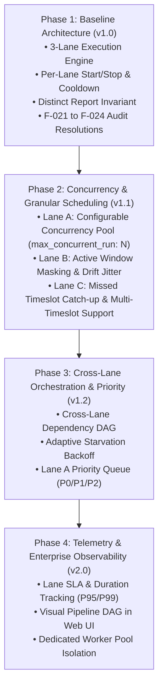

# Paradiso 3-Lane Engine: Development Roadmap

This document outlines the strategic engineering roadmap for the **Paradiso 3-Lane Scheduling Architecture** (Lane A: Sequential Queue, Lane B: Recurring Intervals, Lane C: Pinned Timeslots). It defines completed baselines, near-term enhancements, and mid-to-long-term enterprise milestones.

---

## Architecture Milestone Overview



---

## Phase Breakdown

### Phase 1: Core 3-Lane Engine & Guardrail Baseline (v1.0 — Current)
> [!NOTE]
> **Status: 100% COMPLETE & AUDIT PASSED** (162/162 Unit Tests Passing — 0 Active Audit Defects across F-001 to F-065)

- [x] **Lane A (Sequential Queue & Concurrency Pool):**
  - Priority-aware FIFO queue execution (`P0` $\to$ `P1` $\to$ `P2`) within intraday window (07:00 – 20:59) with 22:00 hard cutoff.
  - Zero-penalty dependency skip rotation (`Retrial`) and genuine error retries (configurable `max_retries`), with strict prefix-based retry-exhaustion filtering (`F-063`).
  - Manual run prevention (`HTTP 403 Forbidden`).
  - Pre-existing closed or uninitialized day record reconciliation and crashed `Running` recovery on boot / lane start (F-028, F-032, F-064).
- [x] **Lane B (Recurring Intervals):**
  - Interval-based background pipelines with self-overlap prevention (`active_runs_type_b`).
  - Rapid spin elimination: interval cooldown tracking on dependency skips (F-022).
  - Exhausted/Failed report isolation preventing infinite recurring loop and accidental manual re-arming (F-041, F-043).
  - On-demand manual execution permitted (`HTTP 200`), honoring full `max_retries` budget even while the lane is in Standby (F-065).
- [x] **Lane C (Pinned Timeslots):**
  - Wall-clock time-pinned reports (BOD 07:00, MID 12:00, EOD 20:30, Custom `HH:MM`).
  - Once-per-day execution enforcement (`type_c_ran_today`).
  - Rapid spin elimination: 5-minute backoff cooldown on skips and retryable errors (F-022).
  - Mid-day reboot hydration from storage preventing duplicate dispatches (F-029, F-031, F-045).
  - On-demand manual execution permitted (`HTTP 200` during `OPEN`), honoring full `max_retries` budget even while the lane is in Standby (F-065).
- [x] **Cross-Lane Security & Invariants:**
  - **Universal Intraday Window Yielding:** All lanes (Lane A, B, C), manual runs, and independent lane starts strictly yield to 07:00–21:00 intraday window, with `WAITING_TO_CLOSE` wrap-up and `22:00` hard cutoff (F-026, F-033, F-044).
  - **Clock Subsystem Integrity:** Cleaned of all `sys.argv` inspection and spoofed timestamp logic (F-025).
  - **Distinct Report Invariant:** A report exists in strictly one lane across the entire catalog (`HTTP 409 Conflict` on duplicate names).
  - **Per-Lane Controls & Daemon Lifecycle:** Independent Start/Stop endpoints (`POST /api/paradiso/lane/start`, `POST /api/paradiso/lane/stop`) with 10-second transition cooldown buffer (`HTTP 429`), automatically stopping the background daemon loop and releasing configuration locks when all lanes are stopped (F-048).
  - **BG-001 Multi-Lane Guardrail & Config Validation:** Idle-only configuration and simulation clock reset mutations enforced across all lanes via `has_active_runs` (F-023, F-042, F-051), with strict non-null, non-boolean schema validation across all scheduler parameters (`max_retries`, `max_rotation_cooldown_seconds`, time windows, and catch-up settings, F-062).
  - **API Validation:** Strict canonical lane identifier enforcement (`VALID_LANES`, F-024) and interval bounds validation (F-046).
  - **Section 12 Receipt Parity:** Exact 1-to-1 filename matching between script `REPORT_NAME` and `storage/automations.json` (F-021).
  - **EOD 20:30 Consistency:** Complete alignment of EOD milestone timing across docs, UI, config, and scheduler (F-027, F-047, F-052).
  - **Frontend-to-Backend Integrity:** Dynamic Lane A/B/C tables without hardcoded mock data, native confirmation modals (`#modal-confirm`) replacing browser `confirm()`/`alert()`, live error retry telemetry (`retry_count / max_retries`, F-050) and dynamic `max_retries` metric cards across all lanes, and interactive `▶ Enable` recovery buttons for `Disabled` and `Failed` reports (F-049).

---

### Phase 2: Concurrency Expansion & Granular Scheduling (v1.1 — Near-Term)
> [!IMPORTANT]
> **Target:** Scale throughput while preserving queue safety, starvation cooldown, and backoff guarantees.

| Lane / Component | Feature Description | Blast Radius & Technical Consideration | Priority |
|---|---|---|---|
| **Lane A** | **Configurable Concurrency Pool (`max_concurrent_run: N`)** `[DONE - VERIFIED]` | Expands Lane A from strict 1-by-1 to a configurable slot semaphore pool ($N \ge 1$, default $1$, max $20$). Queue pass tracking (`_evaluate_pass_completion`) defers starvation cooldown until all parallel slots conclude; dynamically hot-reloads via Settings API. | **HIGH** |
| **Lane B** | **Operating Window Masking** | Enables recurring intervals to be constrained within specific operating hours (e.g., run every 15 minutes, but only between 08:30 and 17:30). | **MEDIUM** |
| **Lane B** | **Interval Jitter & Drift Compensation** | Adds $\pm 5\%$ randomized jitter to avoid thundering-herd spikes when multiple interval pipelines share identical period boundaries. | **LOW** |
| **Lane C** | **Missed Window Catch-up Policy (`lane_c_catch_up_policy`)** `[DONE - VERIFIED]` | Configurable behavior when the scheduler is offline during a pinned timeslot: `CATCH_UP_IMMEDIATE` (run once when booted), `SKIP_UNTIL_NEXT_DAY`, or `WARN_OPERATOR`. Supported globally and via per-report overrides (`Report.catch_up_policy`). Hardened against non-canonical time strings (F-037), API policy dropping (F-038), and operational reset warned set retention (F-039). | **HIGH** |
| **Lane C** | **Multi-Timeslot Pinned Reports** | Allows a single report to pin multiple timeslots in a day (e.g. Morning 08:30 AND Afternoon 16:30) without duplicating records. | **MEDIUM** |
| **UI / Web** | **Dynamic Lane Tables & Native Confirmation Modals** `[DONE - VERIFIED]` | Dynamic rendering for Lane A, Lane B, and Lane C tables with live retry counts, active worker metrics, `▶ Enable` recovery controls, and native obsidian confirmation modals (`#modal-confirm`). | **HIGH** |
| **UI / Web** | **Per-Lane Filter & Quick Actions** `[DONE - VERIFIED]` | Filter Today's Executions table and Automations catalog directly by Lane badge (A / B / C) with 1-click status toggling (`▶ Enable` / `⏸ Disable`). | **MEDIUM** |

---

### Phase 3: Cross-Lane Orchestration & Priority Engine (v1.2 — Mid-Term)
> [!TIP]
> **Target:** Inter-lane dependency coordination and priority/backoff scheduling.

| Feature | Scope & Mechanics | Impact |
|---|---|---|
| **Cross-Lane Dependency DAG** | Allows a report in one lane to depend on reports in another (e.g. Lane C EOD Ledger Reconciliation blocked until Lane B Hourly Feed completes its 17:00 batch). Evaluated without cross-locking. | Eliminates manual sequencing between recurring data feeds and end-of-day ledgers. |
| **Lane A Priority Queuing (`P0`/`P1`/`P2`)** `[DONE - VERIFIED]` | Introduces priority tiers (`P0` Critical, `P1` High, `P2` Normal) within Lane A's queue. Starvation-safe per-pass ordering: `get_pending_by_type("type_a")` and pass boundaries (`_evaluate_pass_completion`) sort `P0 -> P1 -> P2` (FIFO within tier), while mid-pass skips rotate to the back of the current pass so `P0` dependency skips never starve `P1`/`P2` reports. Newly added or re-enabled reports insert ahead of unseen lower-priority reports via `_enqueue_lane_a_by_priority`. | Prevents non-urgent batches from delaying time-critical regulatory extracts without risking dependency starvation. |
| **Adaptive Starvation Backoff** `[DONE - VERIFIED]` | Progressive exponential backoff ($B \times 2^{n-1}$, capped at `max_rotation_cooldown_seconds` default 300s) across consecutive starved passes (`_consecutive_starvation_passes`), paired with event-driven instant wakeup (`wake_lane_a_queue()`) whenever any report completes in Lane A/B/C or a report is added/re-enabled. Upstream completions clear pre-wakeup seen/skip pass state and re-sort `waitlist` by priority so skipped `P0` reports wake immediately (F-061). | Eliminates CPU/subprocess thrashing during long upstream waits while achieving 0ms wakeup latency when data arrives. |

---

### Phase 4: Enterprise Observability & Worker Pool Isolation (v2.0 — Long-Term)
> [!CAUTION]
> **Target:** Multi-tenant resilience, SLA governance, and visual execution flows.

| Feature | Description | Architecture Deliverable |
|---|---|---|
| **Dedicated Worker Pools** | Physical subprocess pool segregation by lane (e.g. Thread/Process Pool A, B, C) so heavy computation in Lane B cannot starve Lane A resources. | CPU & process isolation under OS-level process management. |
| **SLA Tracking & P95 Telemetry** | Historical execution runtime telemetry per report and per lane. Automated visual alerts when run durations breach P95 or SLA thresholds. | Prometheus-compatible metrics endpoint and in-app latency indicators. |
| **Interactive Pipeline DAG Canvas** | Rich interactive visual graph in Web UI rendering pipeline dependency relationships, live run states, and queue bottlenecks. | Client-side SVG/Canvas DAG viewer inside `#view-monitoring`. |
| **Automated Incident Webhooks** | Outbound notification webhooks (Slack, Teams, Email, PagerDuty) on permanent report failures (retries exhausted) or cutoff terminations. | Decoupled notification dispatcher service. |

---

## Tracking & Implementation Checkpoints

```
[Phase 1: Baseline v1.0] ══════════════════════ [100% DONE - AUDIT PASSED]
    ├── Lane A Sequential Queue                [DONE]
    ├── Lane B Recurring Intervals             [DONE]
    ├── Lane C Wall-clock Timeslots            [DONE]
    ├── Distinct Report Invariant              [DONE]
    ├── Independent Lane Controls              [DONE]
    ├── Universal Intraday Window Yielding     [DONE]
    └── F-001 - F-065 Audit Remediations       [DONE - VERIFIED]

[Phase 2: Concurrency & Scheduling v1.1] ═════ [IN PROGRESS - 162/162 TESTS PASSING]
    ├── [P2.1] Lane A Concurrency Expansion    [DONE - VERIFIED]
    ├── [P2.2] Lane C Missed Window Catch-up   [DONE - VERIFIED]
    ├── [UI] 3-Lane Add Report Modal & Form    [DONE - VERIFIED]
    ├── [UI] Dynamic Lane Tables & Modals      [DONE - VERIFIED]
    ├── [UI] Per-Lane Filter & Quick Actions   [DONE - VERIFIED]
    ├── [P2.3] Lane B Window Masking           [PLANNED]
    └── [P2.4] Multi-Timeslot Support          [PLANNED]

[Phase 3: Cross-Lane & Priority v1.2] ════════ [IN PROGRESS]
    ├── [P3.1] Cross-Lane Dependency DAG       [QUEUED]
    ├── [P3.2] Adaptive Starvation Backoff     [DONE - VERIFIED]
    └── [P3.3] Lane A Priority Tiers           [DONE - VERIFIED]

[Phase 4: Enterprise v2.0] ═══════════════════ [FUTURE]
    ├── [P4.1] Dedicated Worker Pools          [FUTURE]
    ├── [P4.2] P95 & SLA Governance            [FUTURE]
    └── [P4.3] Interactive Visual DAG Canvas   [FUTURE]
```
