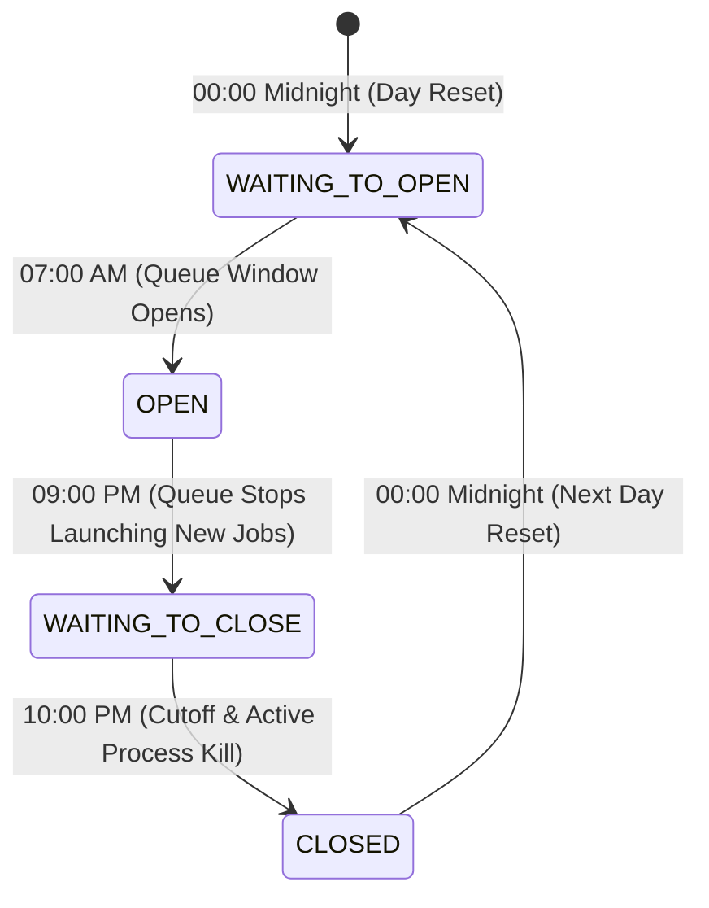
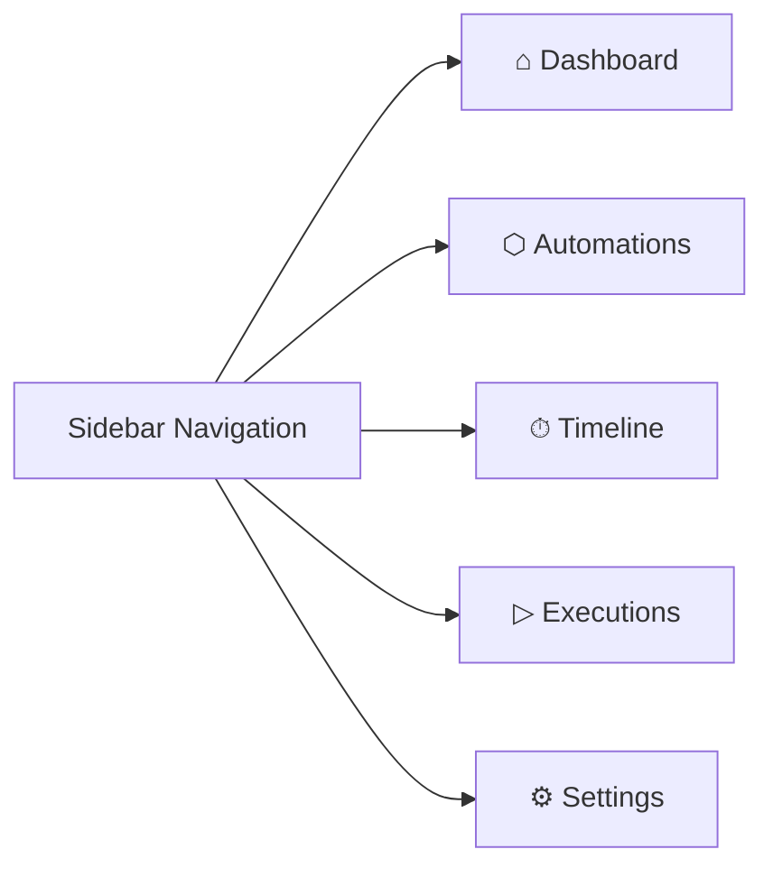

# Technical Documentation & Program Core Logic — Paradiso Alter

## 1. System Overview & Architecture

**Paradiso Alter** is a decoupled, thread-safe daemon scheduling engine and Web UI designed to manage intraday, sequential execution for automated financial and operational report pipelines (Type A reports).

The application follows a clean 4-tier layered architecture:

```mermaid
graph TD
    UI[Web UI / app.js] -->|HTTP REST APIs| Controllers[Controllers Layer]
    Controllers --> DashboardCtrl[DashboardController]
    Controllers --> ParadisoCtrl[ParadisoController]
    Controllers --> AutomationCtrl[AutomationController]
    Controllers --> ExecutionCtrl[ExecutionController]
    Controllers --> SettingsCtrl[SettingsController]
    
    DashboardCtrl & ParadisoCtrl & AutomationCtrl & ExecutionCtrl & SettingsCtrl -->|Service Calls| Services[Services Layer]
    Services --> IntradaySvc[IntradayService]
    Services --> AutoSvc[AutomationService]
    Services --> ExecSvc[ExecutionService]
    
    ExecSvc -->|Process Spawning| Runner[Runner Engine]
    IntradaySvc & AutoSvc -->|Atomic I/O| Repos[Storage Repositories]
    
    Repos --> AutoJSON[(automations.json)]
    Repos --> IntradayJSON[(intraday.json)]
    
    Clock[Clock Engine (utils/clock.py)] -.->|Time Provider| IntradaySvc
    Config[Config Subsystem (utils/config.py)] -.->|Persistence & Hot Reload| SettingsCtrl
```

---

## 2. Core Intraday State Machine & 24-Hour Lifecycle

The system operates on an automated 24-hour window state machine evaluated continuously by `IntradayService.tick()`:



### Time Window Rules

1. **`00:00 AM` – `06:59 AM` (`WAITING_TO_OPEN`)**:
   - When simulated or real date rolls over to midnight, report statuses in `automations.json` automatically reset to **`Waiting`**.
   - A new `IntradayDay` record is initialized for the new date (`YYYYMMDD`).
   - Queue execution remains idle waiting for the intraday start threshold (default: 07:00 AM).

2. **`07:00 AM` – `08:59 PM` (`OPEN`)**:
   - The queue opens. `IntradayService` pops 1 report at a time from `self.waitlist` and executes it via `ExecutionService`.
   - Strict single-tasking is enforced: only **one report** is allowed to run at any given moment (`len(self.current_runs) == 0`).

3. **`09:00 PM` – `09:59 PM` (`WAITING_TO_CLOSE`)**:
   - The queue stops launching **new** reports from `self.waitlist`.
   - In-flight background subprocesses started prior to 9:00 PM are allowed to complete naturally without preemption.

4. **`10:00 PM` – `11:59 PM` (`CLOSED`)**:
   - Hard cutoff at 10:00 PM. Any active running subprocesses are terminated immediately (`runner.kill_all()`).
   - Remaining uncompleted reports in `expected_reports` / `waitlist` are marked as **`Failed`** (*"Not completed before 10:00 PM cutoff"*).
   - The daily record is finalized and saved atomically to `intraday.json`.

### Operational Modes: Autonomous vs. Standby
Controlled via `config.yaml` (`scheduler.auto_start`):

- **Autonomous Production Mode (`auto_start: true`)**:
  - The daemon scheduler (`Paradiso.start()`) launches immediately upon server boot (`app.py`).
  - Evaluates `IntradayService.tick()` continuously in the background.
  - Automatically handles midnight resets, queue opening, evening idle transitions, and 10:00 PM cutoffs across subsequent days.

- **Standby Mode (`auto_start: false`, Default for Dev/Testing)**:
  - The application boots in a safe Standby state (`running: false`, `metrics.running: 0`).
  - No background processes execute automatically until an operator clicks **"Start Scheduler"** in the Web UI or triggers `POST /api/paradiso/start`.
  - Once started, the system transitions to Active Mode and runs the autonomous 24-hour cycle continuously across subsequent days until explicitly paused via **"Stop Scheduler"**.

### Cold Boot & Historical Days Reconciliation
If the server boots up cold after midnight (e.g. 06:00 AM) after a previous day's shutdown:
- `IntradayService.start_fresh_run()` checks whether the current date's record already exists. If missing or new, it calls `automation_service.set_waiting_all()`.
- This ensures reports marked `Completed` from the previous calendar day are never mistakenly carried over or excluded from today's execution queue.
- **Historical Days Auto-Finalization**: `_reconcile_past_days()` scans all prior date entries in `intraday.json`. Any past dates left with `status != "CLOSED"` are automatically finalized to `CLOSED`, with remaining uncompleted jobs recorded as `failed` (*"Historical day finalized automatically"*).

### Crash Recovery & Status Reset
If Paradiso restarts after an unexpected crash or termination:
- Reports left in `Running` status in `automations.json` from a crashed session are automatically reset to `Waiting` upon startup via `IntradayService.start_fresh_run()`, preventing reports from remaining perpetually locked in execution state.

---

## 3. Queue Execution & Rotation Mechanics

### Sequential Execution Policy
Paradiso Alter enforces strict 1-at-a-time execution for intraday Type A reports:
```python
if status == Intraday.OPEN and len(self.current_runs) == 0 and len(self.waitlist) > 0:
    next_report = self.waitlist.popleft()
    self._trigger_report(next_report, today_date)
```

### Dependency Resolution & Queue Rotation
- When a report executes (e.g., `Delinquency_RollRate`), its script checks if required upstream datasets (e.g., `CC_Collection_Summary`) have completed for the current day.
- If upstream dependencies are **missing or unready**:
  1. The report script outputs `SKIPPED: Missing dependency 'X'`.
  2. `IntradayService` records status as `Retrial`.
  3. The report is rotated to the **back of `self.waitlist`** so other independent reports can proceed without blocking the pipeline.
  4. Transient dependency skips do **not** increment the failure retry counter.

### Failure & Retry Policy (Max Retries Threshold)
To prevent infinite fast-spin loops when a script encounters fatal crashes, syntax errors, or missing files:
1. When a script fails (exit code $\ne 0$ or process exception), `IntradayService._on_fail` increments `self.retry_counts[name]`.
2. **Within Limit (`attempts < max_retries`, default: 3)**:
   - Report status is set to `Retrial`.
   - If the queue is active, the report is re-queued to `self.waitlist` to retry later in the window.
   - A timeline warning event is logged: `Re-queued for retry (Attempt X of Y)`.
3. **Threshold Reached (`attempts >= max_retries`)**:
   - The report is marked as terminal **`Failed`** in `automations.json`.
   - A terminal failed run is recorded in `intraday.json` (`day.reports_ran`).
   - The report is **not** re-queued to `self.waitlist`, halting execution spins.
   - An audit alert event is logged: `{name} permanently failed (Exceeded max retries)`.

### Manual Run Protection
- Direct manual execution via `POST /api/automation/run` returns HTTP `403 Forbidden` for Type A intraday reports to prevent manual concurrency collisions with the sequential queue.

---

## 4. Report Management Subsystem (CRUD)

Paradiso Alter supports dynamic management of the report catalog:

### 1. Registration (`POST /api/automation/add`)
- Accepts metadata: `name`, `filename`, `filetype` (`python` / `rscript`), `dir`, `team`, `owner`, `scheduled_time`, `status`.
- **Validation**: Rejects empty `name` or `filename` with HTTP `400 Bad Request`.
- **Conflict Prevention**: Rejects existing report identifiers with HTTP `409 Conflict`.
- **Active Queue Enqueue**: If the intraday scheduler is currently active and `status == "Waiting"`, the report is immediately appended to `intraday_service.waitlist` to execute during the current intraday window.

### 2. Deletion (`DELETE /api/automation/delete/<name>`)
- Verifies report existence (HTTP `404 Not Found` if missing).
- Thread-safely evicts the report from `intraday_service.waitlist` to prevent orphan runner executions.
- Removes report metadata from `storage/automations.json`.

### 3. Creation Modal UI (`#modal-add-report`)
- Dark cathedral modal dialog with backdrop blur and input validation.
- Collects script parameters, team assignments, and runtime engines with inline error feedback.
- Hotkey support: dismisses on <kbd>Escape</kbd> or outside click.

---

## 5. Web User Interface & Navigation Architecture

The Web UI follows a dark cathedral aesthetic and a **1-to-1 navigation model** where every sidebar item opens a distinct, dedicated screen:



### The 5 Core Views

1. **`⌂ Dashboard` (`#view-dashboard`)**:
   - Executive metrics summary (Completed, Running, Retrial, Waiting, Failed) with color-coded progress bars.
   - Today's Live Execution table with quick **"+ Add Report"** action button.
   - Real-time simulation clock badge (speed multiplier, system online status).
   - Global scheduler controls (**Start Scheduler**, **Stop Scheduler**, **Reset (Test)**).

2. **`⬡ Automations` (`#view-automations`)**:
   - Dedicated catalog view displaying all registered automations in a responsive grid.
   - Real-time text search (name, filename, owner).
   - Dropdown filters: Team, Runtime Engine (`python` vs `rscript`), and Status.
   - Metric summary cards (Total Automations, Waiting in Queue, Python count, R-Script count).
   - Action controls: **`+ Add Report`** modal trigger and **`↻ Reset All to Waiting`**.
   - Card management: report details, runtime badges, and direct **Delete** action with confirmation.

3. **`⏱ Timeline` (`#view-timeline`)**:
   - Dedicated, full-page chronological audit trail of all intraday dispatch events.
   - Category filtering: All Events, System, Queue, Success, Failure, Retrial.
   - **Pagination System**: Built for 1,000+ event streams with selector for 15, 25, 50, or 100 rows per page, previous/next controls, and page indicator.

4. **`▷ Executions` (`#view-executions`)**:
   - Execution history across all simulated/real dates.
   - Shows report name, started time, finish time, duration, and exit status.
   - Interactive terminal modal: inspect real-time or historical `stdout` / `stderr` streams for any run.

5. **`⚙ Settings` (`#view-settings`)**:
   - Interactive configuration management backed by `config.yaml`.
   - Settings sections: Core Scheduler, Intraday Time Windows, Simulation Engine, Executable Interpreters, Logging.
   - Live hot-reloading without server restarts.
   - Secret masking for security-sensitive tokens.
   - Quick **"Reset Clock"** button to rewind simulation back to 00:00 midnight.

---

## 6. Process Suppression & Shutdown Safety

### Subprocess Watcher & Process Identity
Reports run as child processes via `subprocess.Popen` in `Runner`. To prevent race conditions during rapid stop/restart cycles, `Runner` tracks process instance identity and unique process IDs:

```python
def _watcher(self, name: str, process: Popen, start_time: float, callback_good: Callable, callback_fail: Callable):
    stdout, stderr = process.communicate()
    with self._proc_lock:
        if self.active_processes.get(name) is process:
            self.active_processes.pop(name, None)
        was_killed = id(process) in self.killed_process_ids or (name in self.killed_processes and self.active_processes.get(name) is not process)
        self.killed_process_ids.discard(id(process))

    if was_killed:
        # Intentionally killed by stop/reset/cutoff — suppress fail callbacks
        return

    if process.returncode == 0:
        callback_good(...)
    else:
        callback_fail(...)
```

### Suppression of False Error Callbacks
When an operator clicks **Stop Scheduler**, **Reset (Test)**, or when 10:00 PM cutoff occurs:
1. `runner.kill_all()` records `id(process)` into `self.killed_process_ids` and invokes `proc.kill()`.
2. When `process.communicate()` unblocks upon termination, `_watcher` detects `was_killed == True` and returns immediately without invoking `_on_fail`.
3. If a new process with the same name is started immediately, the previous watcher does not remove or terminate the newly started process.
4. `Runner._proc_lock` is implemented using `threading.RLock()` to ensure thread-safe re-entrancy during simultaneous callback executions and rapid shutdown sequences.

### Atomic Storage Mutations & Corruption Protection
All file-backed persistence repositories (`Automations`, `Intraday`) inherit from `StorageBase`. Updates are performed via atomic read-modify-write transactions:
```python
storage.mutate(lambda data: data[date].setdefault("timeline", []).append(event))
```
- **Transaction Locking**: `StorageBase.mutate()` holds a reentrant transaction lock (`_global_lock = threading.RLock()`) across read, in-memory modification, and atomic `os.replace()` write cycles with retry backoff for Windows file contention.
- **Storage Durability & Rescue Backups**: If a storage file fails to parse or decode during mutation (due to invalid syntax or file lock), `StorageBase` raises `StorageCorruptionError` and creates an automatic timestamped rescue file (`{stem}_corrupted_{timestamp}.bak`) instead of destructively replacing the file with blank `{}` state.

---

## 7. High-Speed Simulation Clock & Concurrency Model (`utils/clock.py`)

- **Speed Multiplier**: $600\times$ (1 real-time second = 10 simulated minutes).
- **24-Hour Cycle Duration**: 1 full 24-hour simulated day completes in **2.4 minutes** (144 real seconds).
- **Dual Time String Methods**:
  - `CLOCK.time_str()`: Formats 12-hour AM/PM string (`07:00 AM`, `09:15 PM`, `12:00 AM`) for UI rendering.
  - `CLOCK.time_24_str()`: Formats 24-hour `HH:MM` string (`07:00`, `21:00`, `22:00`) for internal state machine evaluations.
- **Re-entrant Concurrency**: Uses `threading.RLock()` to allow safe nested status inspections and baseline resets without self-deadlock.

---

## 8. Storage Schemas

### A. `automations.json` (Report Catalog & State)
```json
{
  "CC_Collection_Summary": {
    "name": "CC_Collection_Summary",
    "filename": "cc_summary.py",
    "filetype": "python",
    "dir": "../reports",
    "team": "Collections",
    "owner": "J. Mendoza",
    "scheduled_time": "08:30",
    "status": "Waiting",
    "duration": "--",
    "started_at": "--",
    "last_run": "--/--/--",
    "last_output": "--"
  }
}
```

### B. `intraday.json` (Daily Runs & Audit Timeline)
```json
{
  "20260906": {
    "date": "20260906",
    "status": "OPEN",
    "expected_reports": ["CC_Collection_Summary", "..."],
    "reports_ran": {
      "CC_Collection_Summary": {
        "started_at": "2026-09-06 07:03:00 AM",
        "finished_at": "2026-09-06 07:03:28 AM",
        "result": "completed",
        "duration": "28s",
        "reason": "CC_Collection_Summary completed successfully in 28s!"
      }
    },
    "timeline": [
      {
        "timestamp": "07:00 AM",
        "title": "Intraday window opened",
        "description": "Sequential queue execution initiated for pending report(s)",
        "type": "system"
      }
    ]
  }
}
```

---

## 9. Complete REST API Reference

| Endpoint | Method | Description |
| :--- | :--- | :--- |
| `GET /` | `GET` | Main application dashboard and Single Page Application HTML. |
| `GET /api/dashboard/stats` | `GET` | Returns report metric counts, execution rates, simulated date/time, and window status. |
| `GET /api/dashboard/timeline` | `GET` | Returns today's timeline audit events in newest-first order. |
| `GET /api/automations` | `GET` | Returns list of all registered reports with current status and metadata. |
| `POST /api/automation/add` | `POST` | Registers a new report, validates uniqueness, and enqueues if scheduler is active. |
| `DELETE /api/automation/delete/<name>` | `DELETE` | Deletes report from catalog and evicts from active waitlist. |
| `POST /api/automations/reset` | `POST` | Resets all reports to `Waiting`, kills active processes, sets Standby mode. |
| `POST /api/paradiso/start` | `POST` | Starts or resumes intraday queue scheduler in active mode. |
| `POST /api/paradiso/stop` | `POST` | Pauses execution, clears `waitlist`, kills running subprocesses. |
| `GET /api/paradiso/status` | `GET` | Returns `{"ok": true, "running": boolean}` daemon status. |
| `POST /api/automation/run` | `POST` | Returns `403 Forbidden` (manual runs disabled for intraday Type A reports). |
| `GET /api/executions/history` | `GET` | Returns historical execution runs across all dates. |
| `GET /api/executions/log/<name>` | `GET` | Returns detailed log output for specified report. Sandboxed: blocks directory traversal (`..`, `/`, `\`) with HTTP 400. |
| `GET /api/settings` | `GET` | Returns current system configuration (secret masked) with runtime metadata. |
| `POST /api/settings` | `POST` | Validates, updates `config.yaml`, and hot-reloads runtime window times and simulation speeds. |
| `POST /api/settings/simulation/reset` | `POST` | Rewinds simulated clock baseline to 00:00:00 midnight today. |

---

## 10. Dynamic Configuration & Settings Subsystem

Configuration is persisted in `config.yaml` and loaded via `utils/config.py`. The subsystem enables dynamic reconfiguration without server restarts:

### Key Configuration Directives
- **`scheduler.auto_start`**: `true` boots directly into Autonomous 24-hr mode; `false` boots into Standby mode.
- **`scheduler.intraday_start_time` / `intraday_idle_time` / `intraday_close_time`**: 24-hour `HH:MM` strings defining intraday state transitions. Hot-reloaded into `IntradayService`.
- **`scheduler.job_interval_seconds`**: Daemon loop polling interval in real-time mode (defaults to 0.5s when simulation mode is active).
- **`scheduler.max_retries`**: Maximum consecutive retry attempts for failing scripts before transitioning to terminal `Failed` state (default: `3`).
- **`simulation.enabled` / `simulation.speed_multiplier`**: Enables accelerated simulation (default `600.0` = 10 simulated minutes per real second). Hot-reloaded into `CLOCK`.
- **`executables.python_path` / `rscript_path`**: Interpreter binary paths for subprocess executions.
- **`logging.level` / `logging.dir`**: Log verbosity and output directory.

---

## 11. Regression Test Suite & Verification

The test suite provides complete end-to-end regression coverage across all layers:

```bash
python run_tests.py
```

### Coverage Breakdown (48 Automated Tests)
- **`tests/test_audit_fixes.py`** (6 tests): Path traversal prevention, storage corruption protection, max retry limits and infinite spin prevention, PID tracking & orphan cleanup, past days reconciliation, and scheduler interval dynamic resolution.
- **`tests/test_api.py`** (16 tests): REST controllers, auto_start startup validation, stats metadata, add/delete automations, waitlist queue synchronization, manual run 403 protection.
- **`tests/test_services.py`** (14 tests): Intraday lifecycle, 10 PM cutoff, cold boot after midnight reset, queue rotation on skipped dependencies, process suppression on shutdown, rapid restart protection.
- **`tests/test_settings.py`** (7 tests): Configuration persistence, secret masking, hot-reloading of time windows and clock speeds, deadlock-free simulation mode toggling, validation error enforcement.
- **`tests/test_storage.py`** (5 tests): Atomic read/write operations, concurrent mutate transaction safety, log parsing, automations and intraday serialization.
