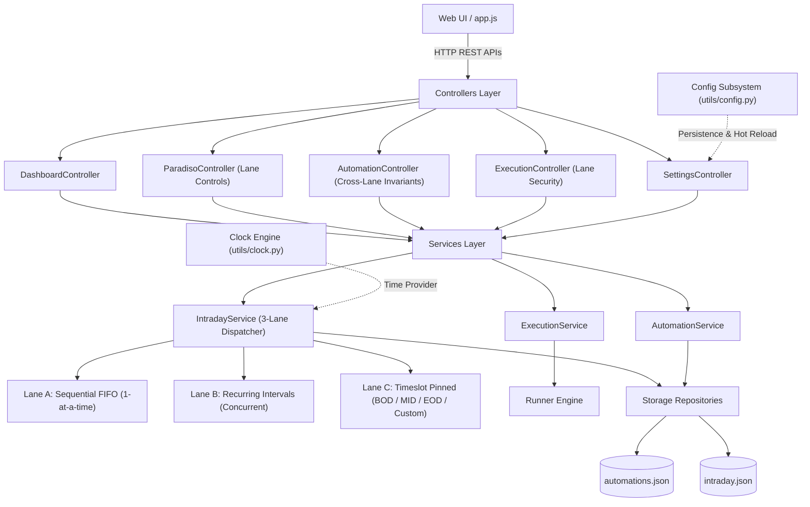
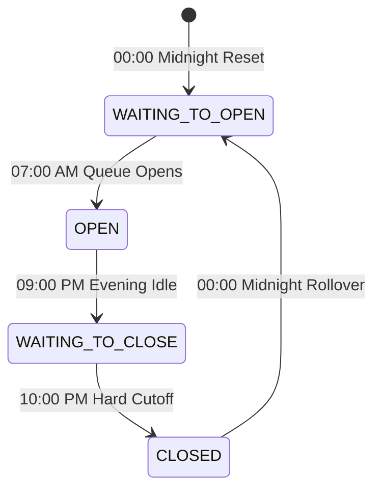
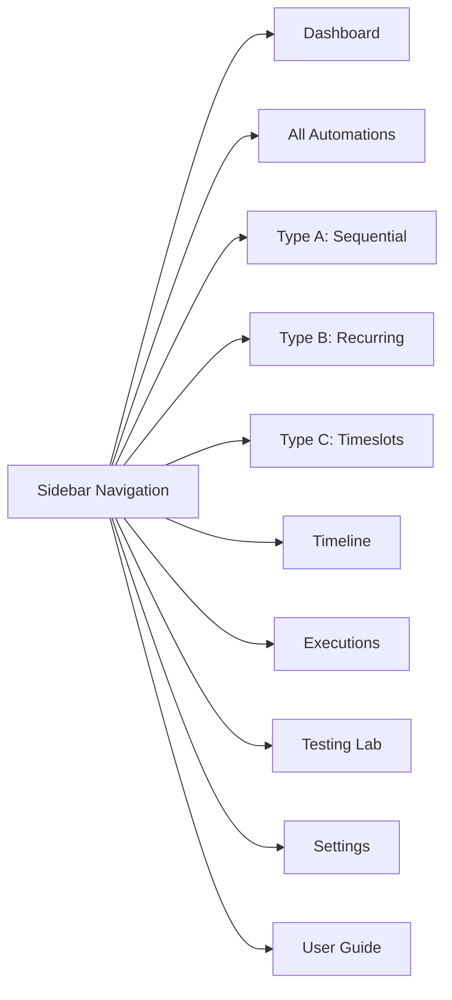

# Technical Documentation & Program Core Logic — Paradiso Alter

## 1. System Overview & Architecture

**Paradiso Alter** is a decoupled, thread-safe daemon scheduling engine and Web UI designed to manage three distinct operational execution lanes for automated financial and operational report pipelines:

1. **Lane A (Sequential Queue)**: Configurable concurrency pool ($N \ge 1$, default 1, max 20) FIFO execution within intraday hours (07:00 – 20:59) with multi-slot starvation cooldown coordination, zero-penalty dependency skips, and a 10:00 PM hard cutoff.
2. **Lane B (Recurring at Intervals)**: Concurrent background pipelines triggered periodically at configurable intervals (e.g. 15m, 30m, 60m) with self-overlap protection.
3. **Lane C (Timeslots)**: Daily wall-clock time-pinned reports (BOD 07:00, Mid-day 12:00, EOD 20:30, or custom `HH:MM`).

The application follows a clean 4-tier layered architecture:


```mermaid
graph TD
    UI["Web UI / app.js"] -->|HTTP REST APIs| Controllers["Controllers Layer"]
    Controllers --> DashboardCtrl["DashboardController"]
    Controllers --> ParadisoCtrl["ParadisoController (Lane Controls)"]
    Controllers --> AutomationCtrl["AutomationController (Cross-Lane Invariants)"]
    Controllers --> ExecutionCtrl["ExecutionController (Lane Security)"]
    Controllers --> SettingsCtrl["SettingsController"]
    
    DashboardCtrl --> Services["Services Layer"]
    ParadisoCtrl --> Services
    AutomationCtrl --> Services
    ExecutionCtrl --> Services
    SettingsCtrl --> Services
    
    Services --> IntradaySvc["IntradayService (3-Lane Dispatcher)"]
    Services --> AutoSvc["AutomationService"]
    Services --> ExecSvc["ExecutionService"]
    
    IntradaySvc --> LaneA["Lane A: Sequential FIFO (1-at-a-time)"]
    IntradaySvc --> LaneB["Lane B: Recurring Intervals (Concurrent)"]
    IntradaySvc --> LaneC["Lane C: Timeslot Pinned (BOD / MID / EOD / Custom)"]
    
    ExecSvc --> Runner["Runner Engine"]
    IntradaySvc --> Repos["Storage Repositories"]
    AutoSvc --> Repos
    
    Repos --> AutoJSON[("automations.json")]
    Repos --> IntradayJSON[("intraday.json")]
    
    Clock["Clock Engine (utils/clock.py)"] -.->|Time Provider| IntradaySvc
    Config["Config Subsystem (utils/config.py)"] -.->|Persistence & Hot Reload| SettingsCtrl
```

---

## 2. Core Intraday State Machine & 24-Hour Lifecycle

The system operates on an automated 24-hour window state machine evaluated continuously by `IntradayService.tick()`:


```mermaid
stateDiagram-v2
    [*] --> WAITING_TO_OPEN: 00:00 Midnight Reset
    WAITING_TO_OPEN --> OPEN: 07:00 AM Queue Opens
    OPEN --> WAITING_TO_CLOSE: 09:00 PM Evening Idle
    WAITING_TO_CLOSE --> CLOSED: 10:00 PM Hard Cutoff
    CLOSED --> WAITING_TO_OPEN: 00:00 Midnight Rollover
```

### Time Window Rules

1. **`00:00 AM` – `06:59 AM` (`WAITING_TO_OPEN`)**:
   - When simulated or real date rolls over to midnight, report statuses in `automations.json` automatically reset to **`Waiting`**.
   - A new `IntradayDay` record is initialized for the new date (`YYYYMMDD`).
   - Queue execution remains idle waiting for the intraday start threshold (default: 07:00 AM).

2. **`07:00 AM` – `08:59 PM` (`OPEN`)**:
   - The queue opens. `IntradayService` pops 1 report at a time from `self.waitlist` and executes it via `ExecutionService`.
   - Strict single-tasking is enforced: only **one report** is allowed to run at any given moment (`len(self.current_runs) == 0`).

3. **`09:00 PM` – `09:59 PM` (`WAITING_TO_CLOSE`)**:
   - The queue stops launching **new** reports from `self.waitlist`.
   - In-flight background subprocesses started prior to 9:00 PM are allowed to complete naturally without preemption.

4. **`10:00 PM` – `11:59 PM` (`CLOSED`)**:
   - Hard cutoff at 10:00 PM. Any active running subprocesses are terminated immediately (`runner.kill_all()`).
   - Remaining uncompleted reports in `expected_reports` / `waitlist` are marked as **`Failed`** (*"Not completed before 10:00 PM cutoff"*).
   - The daily record is finalized and saved atomically to `intraday.json`.

### Operational Modes: Autonomous vs. Standby
Controlled via `config.yaml` (`scheduler.auto_start`):

- **Autonomous Production Mode (`auto_start: true`)**:
  - The daemon scheduler (`Paradiso.start()`) launches immediately upon server boot (`app.py`).
  - Evaluates `IntradayService.tick()` continuously in the background.
  - Automatically handles midnight resets, queue opening, evening idle transitions, and 10:00 PM cutoffs across subsequent days.

- **Standby Mode (`auto_start: false`, Default for Dev/Testing)**:
  - The application boots in a safe Standby state (`running: false`, `metrics.running: 0`).
  - No background processes execute automatically until an operator clicks **"Start Scheduler"** in the Web UI or triggers `POST /api/paradiso/start`.
  - Once started, the system transitions to Active Mode and runs the autonomous 24-hour cycle continuously across subsequent days until explicitly paused via **"Stop Scheduler"**.

### Cold Boot & Historical Days Reconciliation
If the server boots up cold after midnight (e.g. 06:00 AM) after a previous day's shutdown:
- `IntradayService.start_fresh_run()` checks whether the current date's record already exists. If missing or new, it calls `automation_service.set_waiting_all()`.
- This ensures reports marked `Completed` from the previous calendar day are never mistakenly carried over or excluded from today's execution queue.
- **Historical Days Auto-Finalization**: `_reconcile_past_days()` scans all prior date entries in `intraday.json`. Any past dates left with `status != "CLOSED"` are automatically finalized to `CLOSED`, with remaining uncompleted jobs recorded as `failed` (*"Historical day finalized automatically"*).
- **Pre-Existing Prematurely Closed Day Cleansing (F-028)**: If storage contains a pre-existing `CLOSED` record for today's date (e.g., from an anomalous previous shutdown or early auto-finalization), `_get_or_init_day()` detects this condition when entering `WAITING_TO_OPEN` or when manually started with `force_open`. Rather than leaving the engine paralyzed with empty waitlists, it cleanses stale `reports_ran` records, resets catalog reports to `Waiting`, and restores a clean operational slate.

### Crash Recovery, Status Reset & Timeslot Hydration
If Paradiso restarts after an unexpected crash, reboot, or process termination:
- Reports left in `Running` status in `automations.json` from a crashed session are automatically reset to `Waiting` upon startup via `IntradayService.start_fresh_run()`, preventing reports from remaining perpetually locked in execution state.
- **Mid-Day Process Reboot Hydration for Lane C (F-029)**: Lane C maintains `type_c_ran_today` to guarantee once-per-calendar-day execution for timeslot pipelines (BOD, MID, EOD). On service initialization and lane start, `_hydrate_type_c_ran_today()` inspects persisted `day.reports_ran` in `intraday.json` and completed catalog records. Any timeslot report that already completed earlier today is immediately hydrated into memory, ensuring mid-day service reboots never trigger duplicate executions.
- **Web UI Universal Error Notification & HTTP 409 Handling (F-030)**: Web UI client operations (`app.js`) utilize a global `showToast(msg, type)` notification handler. When an operator triggers a lane start outside the allowed intraday window, the backend's HTTP `409 Conflict` error payload is cleanly caught and rendered in a prominent toast notification rather than being silently ignored.

---

## 3. Queue Execution & 3-Lane Dispatch Mechanics

Paradiso Alter orchestrates reports across three distinct execution lanes, each tailored to a specific operational workload:

### Lane A: Sequential FIFO Execution & Concurrency Pool
- **Policy**: Intraday FIFO execution supporting a configurable concurrency pool (`max_concurrent_run: N`, $1 \le N \le 20$, default `1`).
- **Slot Semaphore & Dynamic Replenishment**: `IntradayService.tick()` computes `available_slots = max_concurrent_run - len(current_runs)`. If available slots exist and the queue is not in starvation cooldown, up to `available_slots` reports are popped from `waitlist` and launched in parallel. As any running job completes or skips, its slot is immediately released and replenished on the subsequent daemon tick.
- **Execution Window**: 07:00 – 20:59 with evening wrap-up (21:00) and 22:00 hard cutoff.
- **Dependency Rotation**: Upstream data checks emit `SKIPPED`, transitioning the report to `Retrial` and rotating it to the back of `waitlist` with **zero retry penalty**.
- **Multi-Slot Starvation Cooldown Coordination**: When multiple reports run in parallel, pass completion evaluation (`_evaluate_pass_completion`) is deferred while any jobs remain in flight (`len(self.current_runs) > 0`). Starvation cooldown is only engaged once all concurrent tasks in the pass have concluded, preventing premature cooldown triggers or pass desynchronization.
- **Hot-Reloading & Validation**: `max_concurrent_run` can be dynamically updated via `POST /api/settings` while idle, validated to ensure bounds $1 \le N \le 20$.
- **Manual Execution**: Returns HTTP `403 Forbidden` (`{"ok": false, "error": "Manual execution is disabled for intraday sequential reports. Paradiso manages execution automatically."}`).

### Lane B: Recurring Intervals
- **Policy**: Periodic background pipelines executing throughout the day at configured intervals (e.g. 15, 30, 60 minutes).
- **Concurrency**: Multiple distinct Type B pipelines can execute concurrently.
- **Self-Overlap Prevention**: The engine tracks active executions in `self.active_runs_type_b`. If a previous cycle of report `X` is still in flight, a new trigger for `X` is skipped until the active run terminates cleanly.
- **Manual Execution**: Operators can trigger on-demand runs via `POST /api/automation/run` (`{"ok": true, "name": "..."}`).

### Lane C: Timeslot Pinned
- **Policy**: Pinpoint execution pinned to daily wall-clock milestones:
  - `BOD` (Beginning of Day): 07:00 (intraday open)
  - `MID` (Mid-day): 12:00
  - `EOD` (End of Day): 20:30 (scheduled before 21:00 wrap-up)
  - `CUSTOM`: Configured `scheduled_time` (`HH:MM`)
- **Daily Execution Invariant**: Reports execute once per calendar day at or after their designated milestone (`self.type_c_ran_today`).
- **Missed Window Catch-up Policy (`lane_c_catch_up_policy`)**: Deterministic behavior when the daemon boots or starts after a pinned timeslot:
  - `CATCH_UP_IMMEDIATE` (Default): If started past the milestone within today's operational window, dispatches the report immediately on the first tick and logs a catch-up trigger timeline event.
  - `SKIP_UNTIL_NEXT_DAY`: Automatically transitions the report status to `Skipped`, records the skipped run in `intraday.json`, adds to `type_c_ran_today`, and defers execution to the next day's timeslot.
  - `WARN_OPERATOR`: Logs a single, deduplicated warning audit event (`"Missed scheduled timeslot"`) to the timeline and leaves the report in `Waiting` status for manual on-demand operator execution.
- **Grace Window (`lane_c_catch_up_grace_minutes`)**: Pinned reports starting within the grace window (default: `15` minutes past scheduled time) are treated as on-time and dispatch normally.
- **Per-Report Override Support**: Individual reports can define their own `catch_up_policy` property (`Report.catch_up_policy`), overriding the global system default.
- **Canonical Time Validation & Defensive Normalization (F-037)**: All `scheduled_time` inputs via API registration require strict canonical 24-hour format matching `^([01]\d|2[0-3]):[0-5]\d$`. At runtime, `IntradayService._normalize_timeslot()` defensively handles legacy 12-hour AM/PM and unpadded hour strings to ensure crash-free milestone evaluations.
- **Operational Reset Hygiene (F-039)**: `IntradayService.reset_all_reports()` cleanly purges the `type_c_warned` deduplication set alongside `type_c_ran_today` and `type_c_retry_after`, ensuring operator warnings function properly after an operational reset.
- **Manual Execution**: Operators can trigger on-demand runs via `POST /api/automation/run` during the `OPEN` window.

### Universal Intraday Window Yielding Invariant
All three scheduling lanes (Lane A, Lane B, Lane C) and manual execution strictly yield to the intraday schedule:
1. **`00:00 – 06:59` (`WAITING_TO_OPEN`)**: All lanes idle; automated dispatches and manual execution blocked.
2. **`07:00 – 20:59` (`OPEN`)**: Active execution window for all lanes and on-demand runs.
3. **`21:00 – 21:59` (`WAITING_TO_CLOSE`)**: Wrap-up window; no new runs launched across any lane. In-flight jobs finish naturally. Manual runs blocked with HTTP 409 Conflict.
4. **`22:00 – 23:59` (`CLOSED`)**: Hard cutoff; active subprocesses terminated across all lanes (`runner.kill_all()`), uncompleted jobs logged as Failed. Manual runs blocked with HTTP 409 Conflict.

### Cross-Lane Distinct Report Invariant
A report is strictly distinct across all lanes:
- A report can be assigned to **exactly one lane** (`type_a`, `type_b`, or `type_c`).
- Report names are globally unique case-insensitively across the entire catalog.
- Registering a report with an existing name (in any lane) returns HTTP `409 Conflict`.

### Unified Failure & Retry Policy (3x Error Threshold)
To eliminate infinite fast-spins while guaranteeing operational resilience:
1. When a script encounters a genuine runtime failure (non-zero exit code or uncaught exception), `IntradayService` increments `self.retry_counts[name]`.
2. **Within Threshold (`attempts < 3`)**:
   - Status transitions to `Retrial`.
   - In Lane A, the report is re-queued to `self.waitlist` to retry later in the window.
   - In Lane B & C, the report will retry on the subsequent interval or scheduled trigger.
3. **Threshold Reached (`attempts >= 3`)**:
   - The report is marked as terminal **`Failed`** in `automations.json`.
   - A terminal failure entry is recorded in `intraday.json`.
   - The report is halted from further automatic re-queuing for the day.

---

## 4. Report Management Subsystem (CRUD)

Paradiso Alter supports dynamic management of the report catalog:

### 1. Registration (`POST /api/automation/add`)
- Accepts metadata: `name`, `filename`, `filetype` (`python` / `rscript`), `dir`, `team`, `owner`, `scheduled_time`, `status`, `report_type` (`type_a` | `type_b` | `type_c`), `interval_minutes` (for Type B), `timeslot_tier` (`BOD` | `MID` | `EOD` | `CUSTOM`), and optional `catch_up_policy` (`CATCH_UP_IMMEDIATE` | `SKIP_UNTIL_NEXT_DAY` | `WARN_OPERATOR`).
- **Validation**:
  - Rejects empty `name` or `filename` with HTTP `400 Bad Request`.
  - Rejects directory traversal or unauthorized directory paths with HTTP `400 Bad Request`.
  - Rejects non-canonical `scheduled_time` strings with HTTP `400 Bad Request` (enforces canonical `^([01]\d|2[0-3]):[0-5]\d$`).
  - Rejects invalid `catch_up_policy` values with HTTP `400 Bad Request`.
- **Conflict Prevention**: Rejects existing report identifiers with HTTP `409 Conflict` (enforces distinct report invariant across all lanes).
- **Active Queue Enqueue**: If the intraday scheduler is currently active, `lane_a_active` is true, and `status == "Waiting"` for a Type A report, the report is immediately appended to `intraday_service.waitlist` to execute during the current window.

### 2. Disabling & Re-Enabling (`POST /api/automation/disable`, `POST /api/automation/enable`)
- **Disable (`POST /api/automation/disable`)**: Disables an idle report (`{"name": "Report Name"}`). Rejects actively running reports with HTTP `409 Conflict`. Evicts idle reports from waitlist and rotation passes.
- **Enable (`POST /api/automation/enable`)**: Re-enables a disabled report without destructive reset. Restores status to `Waiting` and enqueues into Lane A if active.

### 3. Deletion (`DELETE /api/automation/delete/<name>`)
- Verifies report existence (HTTP `404 Not Found` if missing).
- **Active Execution Guardrail (F-034)**: Rejects deletion requests with HTTP `409 Conflict` if the report is currently running across any lane or if the scheduler is active.
- Thread-safely evicts the report from `intraday_service.waitlist` to prevent orphan runner executions.
- Removes report metadata from `storage/automations.json`.

### 4. Creation Modal UI (`#modal-add-report`)
- Dark cathedral modal dialog with backdrop blur and input validation.
- Collects script parameters, lane assignments, timeslot tiers, catch-up policies, team assignments, and runtime engines with inline error feedback.
- Hotkey support: dismisses on <kbd>Escape</kbd> or outside click.

---

## 5. Web User Interface & Navigation Architecture

The Web UI follows a dark cathedral aesthetic and a **1-to-1 navigation model** where every sidebar item opens a distinct, dedicated screen:


```mermaid
graph LR
    Sidebar["Sidebar Navigation"] --> Dash["Dashboard"]
    Sidebar --> Auto["All Automations"]
    Sidebar --> LaneA["Type A: Sequential"]
    Sidebar --> LaneB["Type B: Recurring"]
    Sidebar --> LaneC["Type C: Timeslots"]
    Sidebar --> Time["Timeline"]
    Sidebar --> Exec["Executions"]
    Sidebar --> Test["Testing Lab"]
    Sidebar --> Sett["Settings"]
    Sidebar --> Guide["User Guide"]
```

### Core Views & Lane Dispatcher Hub

1. **`⌂ Dashboard` (`#view-dashboard`)**:
   - Executive metrics summary (Completed, Running, Retrial, Waiting, Failed) with color-coded progress bars.
   - **Execution Lanes & Control Hub**: Three dedicated lane control cards (Lane A, Lane B, Lane C) featuring live status badges (`● Active`, `○ Standby`), 10-second transition cooldown indicators, aligned `▶ Start` / `⏹ Stop` action buttons, and direct `View ↗` links to lane tabs.
   - Today's Live Execution table with quick **"+ Add Report"** action button.
   - Top Bar quick control pills for each lane alongside the simulation clock and system status.

2. **`📋 Type A: Sequential` (`#view-type-a`)**:
   - Dedicated dashboard for Bank-grade FIFO intraday pipelines.
   - Metric cards: Single-threaded execution mode, active slot status, dependency skip counters, 10 PM cutoff countdown.
   - Independent Start / Stop controls with transition cooldown guardrail.

3. **`🔄 Type B: Recurring` (`#view-type-b`)**:
   - Dedicated monitor for interval background jobs (15m, 30m, 60m).
   - Metric cards: Multi-threaded concurrent execution, active in-flight count, self-overlap protection status.
   - Independent Start / Stop controls with transition cooldown guardrail.

4. **`⏰ Type C: Timeslots` (`#view-type-c`)**:
   - Dedicated monitor for daily milestone-pinned automations.
   - Visual milestone cards: BOD (07:00), Mid-day (12:00), EOD (20:30), and Custom timeslots.
   - Independent Start / Stop controls with transition cooldown guardrail.

5. **`⬡ All Automations` (`#view-automations`)**:
   - Dedicated catalog view displaying all registered automations across all lanes in a responsive grid.
   - Real-time text search (name, filename, owner) and dropdown filters (Lane Type, Team, Runtime Engine, Status).
   - Action controls: **`+ Add Report`** modal trigger and **`↻ Reset All to Waiting`**.

6. **`⏱ Timeline` (`#view-timeline`)**:
   - Full-page chronological audit trail of all intraday dispatch events with category filters and pagination.

7. **`▷ Executions` (`#view-executions`)**:
   - Execution history across all dates with an interactive terminal modal to inspect `stdout` / `stderr`.

8. **`🧪 Testing Lab` (`#view-testing`)**:
   - Segregated sandbox containing Clock Simulation Engine controls and Intraday State Reset utilities.

9. **`⚙ Settings` (`#view-settings`)**:
   - Interactive configuration management backed by `config.yaml` with live hot-reloading and idle-only modification guardrail.

10. **`📖 User Guide` (`#view-guide`)**:
    - In-app Bento documentation explaining core philosophy, receipt contract, guardrails, and troubleshooting.

---

## 6. Process Suppression & Shutdown Safety

### Subprocess Watcher & Process Identity
Reports run as child processes via `subprocess.Popen` in `Runner`. To prevent race conditions during rapid stop/restart cycles, `Runner` tracks process instance identity and unique process IDs:

```python
def _watcher(self, name: str, process: Popen, start_time: float, callback_good: Callable, callback_fail: Callable):
    stdout, stderr = process.communicate()
    with self._proc_lock:
        if self.active_processes.get(name) is process:
            self.active_processes.pop(name, None)
        was_killed = id(process) in self.killed_process_ids or (name in self.killed_processes and self.active_processes.get(name) is not process)
        self.killed_process_ids.discard(id(process))

    if was_killed:
        # Intentionally killed by stop/reset/cutoff — suppress fail callbacks
        return

    if process.returncode == 0:
        callback_good(...)
    else:
        callback_fail(...)
```

### Suppression of False Error Callbacks
When an operator clicks **Stop Scheduler**, **Reset (Test)**, or when 10:00 PM cutoff occurs:
1. `runner.kill_all()` records `id(process)` into `self.killed_process_ids` and invokes `proc.kill()`.
2. When `process.communicate()` unblocks upon termination, `_watcher` detects `was_killed == True` and returns immediately without invoking `_on_fail`.
3. If a new process with the same name is started immediately, the previous watcher does not remove or terminate the newly started process.
4. `Runner._proc_lock` is implemented using `threading.RLock()` to ensure thread-safe re-entrancy during simultaneous callback executions and rapid shutdown sequences.

### Atomic Storage Mutations & Corruption Protection
All file-backed persistence repositories (`Automations`, `Intraday`) inherit from `StorageBase`. Updates are performed via atomic read-modify-write transactions:
```python
storage.mutate(lambda data: data[date].setdefault("timeline", []).append(event))
```
- **Transaction Locking**: `StorageBase.mutate()` holds a reentrant transaction lock (`_global_lock = threading.RLock()`) across read, in-memory modification, and atomic `os.replace()` write cycles with retry backoff for Windows file contention.
- **Storage Durability & Rescue Backups**: If a storage file fails to parse or decode during mutation (due to invalid syntax or file lock), `StorageBase` raises `StorageCorruptionError` and creates an automatic timestamped rescue file (`{stem}_corrupted_{timestamp}.bak`) instead of destructively replacing the file with blank `{}` state.

---

## 7. High-Speed Simulation Clock & Concurrency Model (`utils/clock.py`)

- **Speed Multiplier**: $600\times$ (1 real-time second = 10 simulated minutes).
- **24-Hour Cycle Duration**: 1 full 24-hour simulated day completes in **2.4 minutes** (144 real seconds).
- **Dual Time String Methods**:
  - `CLOCK.time_str()`: Formats 12-hour AM/PM string (`07:00 AM`, `09:15 PM`, `12:00 AM`) for UI rendering.
  - `CLOCK.time_24_str()`: Formats 24-hour `HH:MM` string (`07:00`, `21:00`, `22:00`) for internal state machine evaluations.
- **Re-entrant Concurrency**: Uses `threading.RLock()` to allow safe nested status inspections and baseline resets without self-deadlock.

---

## 8. Storage Schemas

### A. `automations.json` (Report Catalog & State)
```json
{
  "Hourly_Liquidity_Feed": {
    "name": "Hourly_Liquidity_Feed",
    "filename": "hourly_liquidity_feed.py",
    "filetype": "python",
    "dir": "../reports",
    "team": "Treasury",
    "owner": "Finance Automation",
    "scheduled_time": "09:00",
    "status": "Waiting",
    "report_type": "type_b",
    "interval_minutes": 15,
    "timeslot_tier": "CUSTOM",
    "duration": "--",
    "started_at": "--",
    "last_run": "--/--/--",
    "last_output": "--"
  }
}
```

### B. `intraday.json` (Daily Runs & Audit Timeline)
```json
{
  "20260906": {
    "date": "20260906",
    "status": "OPEN",
    "expected_reports": ["CC_Collection_Summary", "..."],
    "reports_ran": {
      "CC_Collection_Summary": {
        "started_at": "2026-09-06 07:03:00 AM",
        "finished_at": "2026-09-06 07:03:28 AM",
        "result": "completed",
        "duration": "28s",
        "reason": "CC_Collection_Summary completed successfully in 28s!"
      }
    },
    "timeline": [
      {
        "timestamp": "07:00 AM",
        "title": "Intraday window opened",
        "description": "Sequential queue execution initiated for pending report(s)",
        "type": "system"
      }
    ]
  }
}
```

---

## 9. Complete REST API Reference

| Endpoint | Method | Description |
| :--- | :--- | :--- |
| `GET /` | `GET` | Main application dashboard and Single Page Application HTML. |
| `GET /api/dashboard/stats` | `GET` | Returns report metric counts, execution rates, simulated date/time, and window status. |
| `GET /api/dashboard/timeline` | `GET` | Returns today's timeline audit events in chronological (oldest-first) order by default. Supports query parameters `?limit=N` and `?order=asc\|desc`. |
| `GET /api/dashboard/system-status` | `GET` | Returns subsystem operational status and health check across services. |
| `GET /api/automations` | `GET` | Returns list of all registered reports with current status and metadata. |
| `POST /api/automation/add` | `POST` | Registers a new report, validates canonical `scheduled_time` (`HH:MM`), validates `catch_up_policy`, enforces uniqueness across all lanes (HTTP 409 if exists), and enqueues into Lane A if active. |
| `DELETE /api/automation/delete/<name>` | `DELETE` | Deletes report from catalog and evicts from active waitlist. Rejects active executions with HTTP 409 Conflict. |
| `POST /api/automation/disable` | `POST` | Disables an idle report by name (`{"name": "Report Name"}`). Rejects actively running reports with HTTP 409 Conflict. |
| `POST /api/automation/enable` | `POST` | Re-enables a disabled report (`{"name": "Report Name"}`), restoring status to Waiting without destructive reset. |
| `POST /api/automations/reset` | `POST` | Resets all reports to `Waiting`, kills active processes, sets Standby mode. |
| `POST /api/paradiso/start` | `POST` | Starts or resumes intraday queue scheduler in active mode across all lanes. |
| `POST /api/paradiso/stop` | `POST` | Pauses execution, clears `waitlist`, kills running subprocesses across all lanes. |
| `GET /api/paradiso/status` | `GET` | Returns `{"ok": true, "running": boolean}` daemon status. |
| `POST /api/paradiso/lane/start` | `POST` | Starts a specific lane (`{"lane": "type_a"\|"type_b"\|"type_c"}`). Returns HTTP `409 Conflict` outside `OPEN` window (07:00–20:59) unless `force_open: true`. Enforces independent 10s cooldown (HTTP 429). |
| `POST /api/paradiso/lane/stop` | `POST` | Stops a specific lane (`{"lane": "type_a"\|"type_b"\|"type_c"}`). Enforces independent 10s cooldown (HTTP 429). |
| `GET /api/paradiso/lanes/status` | `GET` | Returns live running status, active process count, and remaining cooldown per lane (`type_a`, `type_b`, `type_c`). |
| `POST /api/automation/run` | `POST` | Triggers on-demand report execution. Returns HTTP `403 Forbidden` for Type A (sequential); returns HTTP `409 Conflict` outside `OPEN` window (07:00–20:59); returns `200 OK` and dispatches for Type B and Type C during `OPEN`. |
| `GET /api/executions/history` | `GET` | Returns historical execution runs across all dates. |
| `GET /api/executions/log/<name>` | `GET` | Returns detailed log output for specified report. Sandboxed: blocks directory traversal (`..`, `/`, `\`) with HTTP 400. |
| `GET /api/settings` | `GET` | Returns current system configuration (secret masked) with runtime metadata. |
| `POST /api/settings` | `POST` | Validates, updates `config.yaml`, and hot-reloads runtime window times and simulation speeds. |
| `POST /api/settings/simulation/reset` | `POST` | Rewinds simulated clock baseline to 00:00:00 midnight today. |

---

## 10. Dynamic Configuration & Settings Subsystem

Configuration is persisted in `config.yaml` and loaded via `utils/config.py`. The subsystem enables dynamic reconfiguration without server restarts:

### Key Configuration Directives
- **`scheduler.auto_start`**: `true` boots directly into Autonomous 24-hr mode; `false` boots into Standby mode.
- **`scheduler.max_concurrent_run`**: Maximum concurrent executions permitted in Lane A concurrency pool (range: `1` to `20`, default: `1`). Hot-reloaded into `IntradayService`.
- **`scheduler.intraday_start_time` / `intraday_idle_time` / `intraday_close_time`**: 24-hour `HH:MM` strings defining intraday state transitions. Hot-reloaded into `IntradayService`.
- **`scheduler.job_interval_seconds`**: Daemon loop polling interval in real-time mode (defaults to 0.5s when simulation mode is active).
- **`scheduler.max_retries`**: Maximum consecutive retry attempts for failing scripts before transitioning to terminal `Failed` state (default: `5`).
- **`scheduler.lane_c_catch_up_policy`**: Default catch-up policy for pinned timeslots missed while offline (`CATCH_UP_IMMEDIATE`, `SKIP_UNTIL_NEXT_DAY`, or `WARN_OPERATOR`). Hot-reloaded into `IntradayService`.
- **`scheduler.lane_c_catch_up_grace_minutes`**: Grace window in minutes past scheduled milestone to consider on-time (default: `15`). Hot-reloaded into `IntradayService`.
- **`simulation.enabled` / `simulation.speed_multiplier`**: Enables accelerated simulation (default `600.0` = 10 simulated minutes per real second). Hot-reloaded into `CLOCK`.
- **`executables.python_path` / `rscript_path`**: Interpreter binary paths for subprocess executions.
- **`logging.level` / `logging.dir`**: Log verbosity and output directory.

---

## 11. Regression Test Suite & Verification

The test suite provides complete end-to-end regression coverage across all layers:

### Automated Unit Test Suite (`run_tests.py`)
```bash
python run_tests.py
# or: py -3 run_tests.py
# or: py -3 -m unittest discover tests (from paradiso/)
```

#### Coverage Breakdown (128 Automated Tests)
- **`tests/test_audit_fixes.py`** (86 tests):
  - **Phase 2.1 & Phase 2.2**: Lane A concurrency pool (`max_concurrent_run`: multi-dispatch, slot replenishment, settings hot-reload, bounds validation, starvation cooldown coordination), Lane C missed window catch-up policies (`CATCH_UP_IMMEDIATE`, `SKIP_UNTIL_NEXT_DAY`, `WARN_OPERATOR`), grace window verification, per-report policy overrides, settings validation and dynamic hot-reload.
  - **Batch 6 Remediations (F-037, F-038, F-039)**: Canonical 24-hour `scheduled_time` regex validation (`^([01]\d|2[0-3]):[0-5]\d$`), defensive runtime timeslot normalization (12-hr AM/PM and unpadded hours), API retention and catalog persistence of `catch_up_policy`, and operational reset `type_c_warned` clearance in `reset_all_reports()`.
  - **Batch 4 & 5 Remediations (F-031 to F-036)**: Cold boot Lane C leak prevention (F-031), partial-day cutoff preservation without log wipe (F-032), `force_open` stickiness and cross-lane leakage elimination (F-033), active Type B/C deletion 409 guardrail (F-034), Lane B cold boot historical time handling (F-035), non-destructive automation enabling (F-036).
  - **Vulnerabilities V-01 to V-05**: Automation disabling idle-only 409 guard and waitlist eviction (V-01), Lane B mid-day reboot last-run hydration (V-02), Lane A retry callback lane scoping (V-03), Type A waitlist bleed prevention (V-04), manual run 400/404 parameter validation (V-05).
  - **Phase 1 Baseline & Historical Defect Protections**: 3-Lane architecture (per-lane independent start/stop, 10s transition cooldown, distinct report enforcement with HTTP 409, manual run policies, 3x genuine retry limits, zero-penalty dependency skips), universal intraday window yielding across all lanes, Section 12 exact receipt naming parity (F-021), Lane B/C rapid spin elimination & skip throttling (F-022), BG-001 multi-lane idle settings guardrail (F-023), canonical lane identifier validation (F-024), clock defeat device removal (F-025), out-of-window lane start 409 gating (F-026), EOD timeslot 20:30 consistency (F-027), pre-existing closed day record cleansing (F-028), mid-day restart Lane C timeslot hydration (F-029), Web UI HTTP 409 toast handling (F-030), path traversal prevention, storage corruption protection, PID tracking & orphan cleanup, past days reconciliation, timeline limit/order pagination, in-app documentation rendering, and testing UI segregation.
- **`tests/test_api.py`** (16 tests): REST controllers, auto_start startup validation, stats metadata, add/delete automations, waitlist queue synchronization, manual run 403 protection.
- **`tests/test_services.py`** (14 tests): Intraday lifecycle, 10 PM cutoff, cold boot after midnight reset, queue rotation on skipped dependencies, process suppression on shutdown, rapid restart protection.
- **`tests/test_settings.py`** (7 tests): Configuration persistence, secret masking, hot-reloading of time windows and clock speeds, deadlock-free simulation mode toggling, validation error enforcement.
- **`tests/test_storage.py`** (5 tests): Atomic read/write operations, concurrent mutate transaction safety, log parsing, automations and intraday serialization.

### Adversarial PoC Verification Suite (`verify_all.py`)
```bash
python paradiso/artifacts/audits/poc/verify_all.py
# or: py -3 paradiso/artifacts/audits/poc/verify_all.py
```

The unified adversarial test harness runs 9 isolated audit suites (35 checks) verifying all historical and active audit findings:
- **`poc_bg001_bg002_verification.py`**: Idle 409 guard, 25-thread burst mutex, 10s transition cooldown.
- **`poc_f001_verification.py`**: Active deletion 409 guard & missing queue recovery without deadlock.
- **`poc_f002_verification.py`**: Path traversal defense across 14 malicious attack vectors.
- **`poc_f003_verification.py`**: Executable path whitelist & arbitrary host execution rejection.
- **`poc_f004_verification.py`**: Section 12 receipt contract & retry counter non-consumption on dependency skips.
- **`poc_f006_f008_verification.py`**: Monotonic PID heap reuse & Windows 3-tier tree kill.
- **`poc_f007_verification.py`**: Storage corruption backup deduplication & 5-backup cap.
- **`poc_f010_verification.py`**: 22:00 cutoff termination & pre-existing day rollover.
- **`poc_f021_f024_verification.py`**: Exact receipt discovery (F-021), Lane B/C skip throttling (F-022), multi-lane 409 guard (F-023), strict lane name whitelist (F-024).

**Result**: **9/9 suites passing (100% OK, 0 defects)**.

---

## 12. The Report Receipt Contract (Type A Pipelines)

To eliminate silent closures, regulatory non-compliance, and unverified batch completions in financial and operational environments, Paradiso enforces a **strict receipt contract** for all scheduled reports.

### The 3 Sovereign Report States
Every pipeline script emits one of three definitive states:
1. **`Completed`**: The workload extracted, transformed, and published its deliverables successfully.
2. **`Retrial`**: An upstream dependency (e.g. database table, core feed, external file) is not ready. Paradiso rotates the report to the back of the intraday queue **without consuming retry counts**.
3. **`Failed`**: A critical error or unhandled exception occurred. Paradiso increments error retries up to `max_retries` (default: 3) before marking terminal failure.

### The Receipt File (`paradiso/logs/{name}.json`)
Before exiting, every report script must persist a structured JSON receipt to `paradiso/logs/{name}.json` (or dated `{name}_YYYYMMDD.json`):

```json
{
  "name": "agency_perf.py",
  "status": "Completed",
  "last_run": "2026-09-23 08:30:15",
  "duration": "4.2s",
  "last_output": "1,540 agency transactions processed successfully",
  "reason": "All upstream validations passed"
}
```

### Contract Violation Policy
- If a script terminates without producing a valid, non-empty receipt in `paradiso/logs/`, Paradiso rejects the execution as a **Contract Violation** (`status="Failed"`).
- The defective script consumes error retry attempts and is terminally expelled from the queue after exceeding `max_retries`, ensuring broken or un-templated scripts never spin indefinitely or falsely report success.
