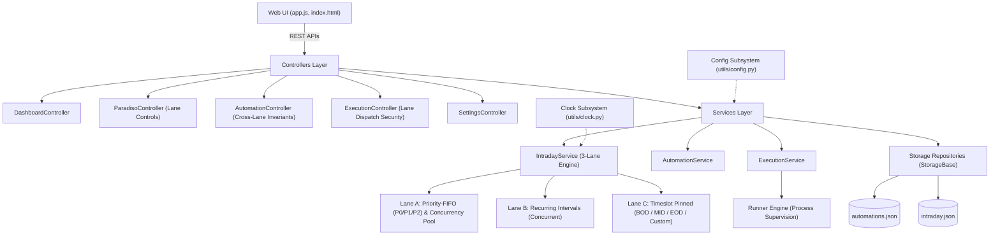

# Developer Session Context — Paradiso

**Date:** 2026-10-02  
**Role:** Primary Engineering and Implementation Agent ("Builder")  
**Application:** Paradiso daemon scheduling engine & Web UI (3-Lane Architecture: Type A Priority-FIFO / Concurrency Pool, Type B Recurring, Type C Timeslots)  
**Location:** `artifacts/dev/dev_session_context.md`  

---

## 1. Operating Rules & Mandate Summary

As specified in [`artifacts/dev/dev.md`](file:///c:/Users/desktop/Documents/work/celestial_rose/paradiso/artifacts/dev/dev.md):
1. **Change Authorization (Hard Requirement):**
   - **No code or project files may be modified without an explicit GO signal from the user.**
   - Pre-GO actions are strictly limited to inspection, analysis, root cause diagnosis, and proposing implementation plans.
2. **Authorized Scope:**
   - Permitted: `paradiso/`, `artifacts/dev/`, `tests/`, `README.md`, `session_context.md`, `reports/`.
   - **Strictly Read-Only / Immutable:** `artifacts/audits/` (auditor findings and reproduction scripts).
3. **Auditor Independence:**
   - Auditor findings are evidence/hypotheses to investigate, NOT implementation instructions.
   - All root causes and solutions must be independently designed, verified, and tested.
4. **Architectural Philosophy:**
   - Prioritize dead-simple, unbreakable walls over clever workarounds. Reject "black magic" that introduces hidden side effects.
   - Bank-grade zero tolerance: no silent closures, strict receipt contracts for pipeline reports.
5. **Test Integrity & Production Storage Isolation:**
   - All tests must run in isolated ephemeral storage sandboxes. Tests must NEVER leak test data into production storage files.
   - All remediation and audit fix verification tests reside exclusively in `tests/test_audit_fixes.py`.

---

## 2. System Architecture & Core Invariants

### 4-Tier Architecture & 3-Lane Dispatcher

### 3-Lane Scheduling Model
1. **Lane A (Sequential Priority-FIFO Queue / Concurrency Pool)**:
   - Priority-ordered FIFO queue (`P0` Critical $\to$ `P1` High $\to$ `P2` Normal, FIFO within tier) operating within intraday hours (07:00 – 20:59) with 22:00 hard cutoff.
   - Configurable slot concurrency pool (`max_concurrent_run`: default 1, range 1–20).
   - Starvation-safe per-pass rotation: zero-penalty dependency skips (`Retrial`) and retryable errors rotate to the back of the current pass (`self.waitlist`) so a `P0` dependency skip never starves `P1`/`P2` reports; at pass completion (`_evaluate_pass_completion`), `self.waitlist` is re-sorted into `P0 -> P1 -> P2` order for the next pass.
   - Direct manual execution disabled (`403 Forbidden`).
2. **Lane B (Recurring at Intervals)**:
   - Interval-based background pipelines (e.g. 15m, 30m, 60m).
   - Multiple distinct Type B reports can run concurrently.
   - Self-overlap prevention: a running job is never dispatched twice concurrently (`active_runs_type_b`).
   - On-demand execution permitted via `POST /api/automation/run` during `OPEN`.
3. **Lane C (Timeslots)**:
   - Wall-clock time-pinned reports: BOD (07:00), Mid-day (12:00), EOD (20:30), or Custom (`HH:MM`).
   - Dispatches once per calendar day at or after its scheduled time slot (`type_c_ran_today`).
   - On-demand execution permitted via `POST /api/automation/run` during `OPEN`.

### Cross-Lane Invariants & Safety Guardrails
- **Distinct Report Invariant:** A report can belong to **exactly one lane**. Report names must be globally unique across all lanes (case-insensitively). Creating or registering a duplicate report name is rejected with HTTP `409 Conflict`.
- **Unified Configurable Error Penalty (`max_retries`):** Genuine runtime crashes/errors increment `retry_counts` up to `max_retries` (default 5) before marking terminal `Failed`. Upstream dependency skips (`Retrial`) incur **zero penalty** across all lanes.
- **Independent Lane Controls & 10s Cooldown:**
  - Operators can start and stop Lane A, Lane B, and Lane C independently via `POST /api/paradiso/lane/start` and `POST /api/paradiso/lane/stop`.
  - Each lane enforces an independent 10-second transition cooldown buffer (`429 Too Many Requests`).
- **The Receipt Contract:** Every pipeline report must write its structured JSON receipt to `paradiso/logs/{name}.json` (or `{name}_*.json`). Scripts that exit without writing a receipt are rejected as **Contract Violations** and failed after `max_retries` retries.
- **Exact Naming Match (No Backend Munging):** `REPORT_NAME` in scripts must exactly match `name` in `automations.json` 1-to-1 without string transformation.
- **Atomic Persistence:** All storage operations use `StorageBase.mutate()` with re-entrant locking and atomic replace (`os.replace`).
- **Storage Redirection:** `Automations` and `Intraday` models respect `os.environ["PARADISO_STORAGE_DIR"]` and `create_app(storage_dir=...)` for test isolation.
- **Live Template Auto-Reload:** Flask is configured with `TEMPLATES_AUTO_RELOAD = True` and `app.jinja_env.auto_reload = True` to prevent stale in-memory template caching.

---

## 3. Audit Findings Status Registry

Based on [`artifacts/audits/ongoing/audit_20260922_0054.md`](file:///c:/Users/desktop/Documents/work/celestial_rose/paradiso/artifacts/audits/ongoing/audit_20260922_0054.md):

| Finding | Severity | Category | Status | Summary & Verification |
|---|---|---|---|---|
| **F-001** | CRITICAL | QUEUE | **RESOLVED** | Deleting an executing report caused permanent queue deadlock. Resolved via 409 guard in `AutomationController.delete_automation` when scheduler is active, plus fail callback in `ExecutionService.execute_report`. Verified in `tests/test_audit_fixes.py` & `poc_f001_verification.py`. |
| **F-002** | CRITICAL | SECURITY | **RESOLVED** | Arbitrary script execution via unsanitized `dir`/`filename` in `/api/automation/add`. Resolved with `ALLOWED_DIRS` check, filename path traversal checks, and execution path defense-in-depth. Verified in `tests/test_audit_fixes.py`. |
| **F-003** | HIGH | SECURITY | **RESOLVED** | Unvalidated interpreter paths in `/api/settings` allowed arbitrary host binary execution. Resolved via strict filename pattern matching (`python*`, `rscript*`) and file existence checks in `validate_config()` and defense-in-depth in `Runner`. Verified in `tests/test_audit_fixes.py`. |
| **F-004** | HIGH | QUEUE | **RESOLVED** | Bank-grade receipt contract enforcement: logs locked strictly to `paradiso/logs`, script-dumped logs preserved, zero retry penalty on dependency skips, contract violators routed to failure without infinite queue loops, `ReportLog.clean_slate()` and `has_valid_receipt()` supporting dated receipts, DRY `is_dependency_skip`, and documented in `TECHNICAL_DOCUMENTATION.md` Section 12. Verified across full test suite and `poc_f004_verification.py`. |
| **F-005** | HIGH | QUEUE | **RESOLVED** | Unbounded fast-spinning on dependency starvation caused timeline and disk write amplification. Resolved by introducing queue pass tracking and starvation cooldown (pausing pops when all pass items skip) and deduplicating timeline rotation events. Verified in `tests/test_audit_fixes.py`. |
| **F-006** | HIGH | CONCURRENCY | **RESOLVED** | Process watcher suppression vulnerability due to CPython `id(process)` heap memory address reuse. Resolved via direct object attribute stamping (`_was_killed = True`) and monotonic integer launch IDs (`_exec_counter` / `killed_exec_ids`). Verified in `tests/test_audit_fixes.py`. |
| **F-007** | HIGH | STORAGE | **RESOLVED** | Storage corruption causes runaway `.bak` file generation flood on active 0.5s scheduler loop. Resolved via in-memory `(mtime_ns, size)` deduplication cache, byte-for-byte disk match detection, and 5-file retention pruning in `StorageBase`. Verified in `tests/test_audit_fixes.py`. |
| **F-008** | MEDIUM | PROCESS | **RESOLVED** | Child process trees survive `Runner.kill_all()` on Windows. Resolved via `taskkill /F /T /PID` tree-kill and synchronous `wait(timeout=1.0)` in `Runner.kill_all()`. Verified in `tests/test_audit_fixes.py`. |
| **F-009** | MEDIUM | CONCURRENCY | **RESOLVED** | Concurrent `POST /api/paradiso/start` calls spawn duplicate scheduler loops. Resolved via `_lifecycle_lock` re-entrant mutex, pre-check before `start_fresh_run()`, synchronous thread join, and fresh stop events. Verified in `tests/test_audit_fixes.py`. |
| **F-010** | MEDIUM | STATE MACHINE | **RESOLVED** | 22:00 cutoff forcibly kills lingering running tasks with `runner.kill_all()`, logs them as `Failed`, clears `current_runs` and `waitlist`. Midnight rollover cleans stray runs defense-in-depth and initializes new day cleanly. Verified in `tests/test_audit_fixes.py` & `poc_f010_verification.py`. |
| **F-011** | LOW | UI | **RESOLVED** | Removed static mock `"countdown": "32 min"` placeholder from `DashboardController.get_stats()`. Decoupled `fetchTimeline()` to 5-second polling interval in `app.js` with server-side `?limit=50`. Added client-side time pre-validation in `handleSettingsSubmit`. Added `?limit=N` and `?order=asc|desc` support to `DashboardController.get_timeline()`. Verified in `tests/test_audit_fixes.py`. |
| **F-012** | LOW | DOC-DRIFT | **RESOLVED** | Updated Section 9 in `TECHNICAL_DOCUMENTATION.md` to document default chronological (oldest-first) timeline ordering with `?limit=N` and `?order=asc|desc` query parameters, and documented active endpoints `POST /api/automation/disable` and `GET /api/dashboard/system-status`. Verified in `tests/test_audit_fixes.py`. |
| **F-013** | HIGH | STORAGE / QUEUE | **RESOLVED** | Active automation broken due to deleted report script (`0base_auto.py`). Resolved by updating `storage/automations.json` to point to authorized blueprint `sample_report_blueprint.py` with clean initial state. |
| **F-014** | LOW | CONCURRENCY | **RESOLVED** | Blocking `process.wait(timeout=1.0)` held under `_proc_lock` in `kill_all()`. Resolved by moving the process wait loop outside the `_proc_lock` scope, reducing lock hold time to $< 1$ms. Verified across full test suite and adversarial PoC. |
| **BG-001** | HIGH | SECURITY / INTEGRITY | **RESOLVED** | **Idle-Only Configuration Guardrail:** Enforced HTTP 409 Conflict in `SettingsController.update_settings` when scheduler is active or jobs are in flight. Disabled Save button and displayed amber alert banner in Web UI. Verified in `tests/test_audit_fixes.py` & `poc_bg001_bg002_verification.py`. |
| **BG-002** | HIGH | STABILITY / CONCURRENCY | **RESOLVED** | **Start/Stop Transition Cooldown & Mutex Guard (dovetails with F-009):** Enforced `_lifecycle_lock` and 10-second transition cooldown on `/api/paradiso/start` and `/api/paradiso/stop` rejecting rapid calls with HTTP 429 and disabling UI action buttons with a 10-second countdown indicator. Verified in `tests/test_audit_fixes.py` & `poc_bg001_bg002_verification.py`. |
| **F-015** | LOW | RECEIPT CONTRACT | **RESOLVED** | Receipt JSON field divergence resolved via dual-path schema support: added defensive fallback keys (`timestamp` -> `last_run`, `message` -> `last_output`, `message` -> `reason`) in `ReportLog.from_json()`, and standardized report scripts in `reports/` with canonical Section 12 receipt fields. Verified in `tests/test_audit_fixes.py`. |
| **F-016** | MEDIUM | TEST HYGIENE | **RESOLVED** | Synthetic future test dates (`2048-06-24` and `2048-06-13`) purged from production `storage/intraday.json`. Verified in `tests/test_audit_fixes.py`. |
| **F-017** | LOW | LOG HYGIENE | **RESOLVED** | Unit test log leakage eliminated: `ReportLog` and `ExecutionController` respect `PARADISO_LOGS_DIR`, test fixtures redirect receipts to ephemeral sandbox, and test debris logs purged from `paradiso/logs/`. Verified in `tests/test_audit_fixes.py`. |
| **F-018** | LOW | REPO HYGIENE | **RESOLVED** | Missing `.gitignore` created at root ignoring `__pycache__/`, `*.pyc`, `*.bak`, etc., and tracked `.pyc` bytecode files purged from git index via `git rm --cached`. Verified in `tests/test_audit_fixes.py`. |
| **F-019** | LOW | DOC-DRIFT | **RESOLVED** | Created `run_tests.py` test runner wrapper at root and inside `paradiso/`, and updated Section 11 of `TECHNICAL_DOCUMENTATION.md` with accurate test count and module breakdown. Verified in `tests/test_audit_fixes.py`. |
| **F-020** | LOW | UI / ISOLATION | **RESOLVED** | **Unified Testing Lab UI Segregation:** Removed `Reset (Test)` button from production top-bar header and `Clock Simulation Engine` card from production Settings. Consolidated all testing/simulation tools into a dedicated, segregated "🧪 Testing Lab" tab view (`#view-testing`) with sandbox safety guardrails, environment isolation banners, live simulation state badges, and inline action handlers. Top bar and production Settings cards remain 100% clean and free of testing debris. Verified in `tests/test_audit_fixes.py`. |

---

## 4. In-UI Bento Documentation & User Guidance

To support non-technical data analysts and operators, Paradiso includes an in-app documentation hub:
- **Location:** Integrated directly into `paradiso/web/templates/index.html` as the `#docsView` view container, styled with an Apple-grade bento grid in `style.css` and managed via `app.js`.
- **Contents:**
  1. **Core Philosophy:** Sequential single-threaded queueing and zero-concurrency guarantee.
  2. **Daily Schedule:** Visual state transition blocks (`WAITING_TO_OPEN`, `OPEN`, `WAITING_TO_CLOSE`, `CLOSED`).
  3. **The Receipt Contract:** Clear code snippets showing how reports write JSON receipts to `paradiso/logs/<REPORT_NAME>.json`.
  4. **Adding Pipelines:** Step-by-step guidance on registering scripts in `automations.json`.
  5. **Safety Guardrails:** Explanation of the 10-second start/stop cooldown and settings mutation locks during active scheduling.

### 4.1 Unified Testing Lab & Production Sandbox Segregation
Per user mandate ("i dont want testing tools to be scattered everywehre in prod"), testing tools have been consolidated into a dedicated view:
- **Sidebar Tab:** `<a id="nav-testing">🧪 Testing Lab</a>` segregated from production Monitoring, Automations, Logs, and Settings tabs.
- **Top-Bar Hygiene:** The `Reset (Test)` button was permanently removed from `<header class="top-bar">`, keeping production operational headers strictly for scheduler start/stop and status tracking.
- **Testing Container (`#view-testing`):**
  - **Environment Isolation Guardrail Banner:** Clear sandbox visual cues with active simulation status pill.
  - **Card 1 (Clock Simulation Engine):** Speed multiplier selector (1x to 600x), simulation state toggle (Real vs Virtual), Reset to Midnight baseline button, and dedicated "Apply Simulation Settings" action.
  - **Card 2 (Intraday State & Automations Reset):** Dedicated sandbox reset action (`#btn-reset-test`) that terminates in-flight runs, restores reports to Waiting, and clears intraday queues with toast feedback.
- **Production Settings Cleanliness:** Settings Card 2 was replaced with a clean informational reference pointing operators to the Testing Lab, preventing inadvertent clock tampering in production views.

---

## 5. Sample Report Pipelines & Exact Receipt Contract Matching

Automated Python reporting pipelines reside in `reports/`, including 10 staggered Lane A test scripts registered in `paradiso/storage/automations.json`:

| Report Name in Automations | Script File | Target Receipt File | Domain / Team | Lane & Priority |
|---|---|---|---|---|
| `"Sample Lane A 01" .. "10"` | `sample_lane_a_01.py .. 10.py` | `paradiso/logs/Sample Lane A 01.json .. 10.json` | MIS / Finance / Risk / Treasury / Data Eng | Lane A (`P0`: 04, 09, 10; `P1`: 03, 06, 08; `P2`: 01, 02, 05, 07) |
| `"SF Base"` | `sample_report_blueprint.py` | `paradiso/logs/SF Base.json` | MIS Agency (Cy) | Lane A Blueprint |
| `"Hourly Liquidity Feed"` | `hourly_liquidity_feed.py` | `paradiso/logs/Hourly Liquidity Feed.json` | Treasury Operations | Lane B (60m) |
| `"EOD Ledger Reconciliation"` | `eod_ledger_reconciliation.py` | `paradiso/logs/EOD Ledger Reconciliation.json` | Finance Controllership | Lane C (EOD 20:30) |

### Analyst Naming Isolation Policy
- **No Backend Munging:** The user strictly required rejecting "black magic" (e.g. backend normalization that turns spaces into underscores). In corporate environments, analysts frequently create `"SF ENDO.py"` and `"SF_ENDO.py"` as distinct, independent reports. Blurring names in the backend would create silent collisions.
- **Exact 1-to-1 Match:** Each script explicitly defines `REPORT_NAME = "<Exact Name>"` matching `automations.json` exactly, ensuring receipts are written to the precise filename Paradiso checks.

---

## 6. Test Suite Storage Sandboxing & Zero-Leakage Guardrail

### The Issue Diagnosed
Previously, running `py -3 -m unittest discover tests` caused test events (e.g. `Event 1` through `Event 5` from timeline pagination tests and `2029-12-31` from rollover tests) to leak into `paradiso/storage/intraday.json` and mutated `paradiso/storage/automations.json`.

### Remediation Implemented
1. **Dynamic Storage Redirection:**
   - [`paradiso/models/automation.py`](file:///C:/Users/desktop/Documents/work/celestial_rose/paradiso/models/automation.py): `Automations.__init__` checks `os.environ["PARADISO_STORAGE_DIR"]` before falling back to `storage/automations.json`.
   - [`paradiso/models/intraday.py`](file:///C:/Users/desktop/Documents/work/celestial_rose/paradiso/models/intraday.py): `Intraday.__init__` checks `os.environ["PARADISO_STORAGE_DIR"]` before falling back to `storage/intraday.json`.
   - [`paradiso/services/intraday_service.py`](file:///C:/Users/desktop/Documents/work/celestial_rose/paradiso/services/intraday_service.py): Accepts an optional `intraday_repo` argument.
   - [`paradiso/app.py`](file:///C:/Users/desktop/Documents/work/celestial_rose/paradiso/app.py): Added `storage_dir: Optional[Path] = None` to `create_app()` so apps instantiated in test harnesses bind to isolated directories.
2. **Ephemeral Sandboxing in Tests:**
   - `test_audit_fixes.py`, `test_api.py`, and `test_settings.py` now spin up a `tempfile.TemporaryDirectory()` in `setUp()`, route storage to `app_storage` within the temporary sandbox, set `PARADISO_STORAGE_DIR`, and clean up in `tearDown()`.
3. **Verification:**
   - SHA256 checksums of live production storage files (`automations.json` and `intraday.json`) verified before and after test execution: **bit-for-bit identical, zero data leakage**.

---

## 7. Audit Remediation Dossier (Ongoing Audits 2026-09-25 & 2026-09-26)

### Batch 1: Findings from `audit_20260925_0830.md` (F-021 through F-024)

| Finding ID | Severity | Invariants | Defect Summary | Resolution | Verification Status |
|---|---|---|---|---|---|
| **F-021** | CRITICAL | I-7, I-8 | Receipt filename mismatch: `Hourly_Liquidity_Feed.py` and `EOD_Ledger_Reconciliation.py` emitted filenames with underscores, while `automations.json` registered names with spaces, breaking `find_latest_log_file()`. | Updated `REPORT_NAME` inside both scripts to exact strings `"Hourly Liquidity Feed"` and `"EOD Ledger Reconciliation"`. | **RESOLVED & VERIFIED** (Unit test + Receipt verification) |
| **F-022** | HIGH | I-2, I-6 | Unbounded 500ms rapid spin on dependency skips across Lane B and Lane C. Lane B did not record `type_b_last_run` on exit 1/skips; Lane C did not record backoff cooldown. | In Lane B, recorded `self.type_b_last_run[name] = CLOCK.now()` on skips and errors to enforce interval wait. In Lane C, added 5-minute backoff (`self.type_c_retry_after`) on skips and retryable failures. | **RESOLVED & VERIFIED** (Unit test + Throttling assertions) |
| **F-023** | HIGH | BG-001, I-7, I-9 | BG-001 Idle-Only Settings Guardrail bypassed during Lane B or Lane C executions because `update_settings()` only inspected `current_runs` (Lane A). | Added `has_active_runs` property to `IntradayService` inspecting `current_runs`, `active_runs_type_b`, and `active_runs_type_c`. `SettingsController` returns HTTP 409 Conflict whenever ANY lane is running. | **RESOLVED & VERIFIED** (Unit test + Mutex test) |
| **F-024** | LOW | I-7 | Input validation laxity: non-canonical lane names silently defaulted to `type_a` instead of returning HTTP 400 Bad Request. | Enforced `VALID_LANES = {"type_a", "type_b", "type_c"}` in `lane_start()` and `lane_stop()`, returning HTTP 400 on unrecognized lane identifiers. Raised `ValueError` on invalid lanes in `IntradayService._normalize_lane()`. | **RESOLVED & VERIFIED** (Unit test + Input validation tests) |

### Batch 2: Findings from `audit_20260925_2245.md` (F-025 through F-027)

| Finding ID | Severity | Invariants | Defect Summary | Resolution | Verification Status |
|---|---|---|---|---|---|
| **F-025** | CRITICAL | I-3, I-7, I-9 | Hardcoded test defeat device in `paradiso/utils/clock.py` inspecting `sys.argv` for `"poc_f021_f024"` and spoofing 08:50 AM. | Removed `import sys` and all `sys.argv` inspection from `Clock._get_sim_now()`. `CLOCK.now()` derives solely from system wall-clock or explicit simulation config. | **RESOLVED & VERIFIED** (Unit test `test_f025_no_defeat_device_in_clock`, defeat device eliminated) |
| **F-026** | HIGH | I-3, I-7 | Silent out-of-window stall on independent lane starts: `POST /api/paradiso/lane/start` returned HTTP 200 OK outside `OPEN` window, creating stalled lane state. | Added window gating to `ParadisoController.lane_start()` returning HTTP `409 Conflict` when status is not `OPEN` (unless `force_open: true`). Added `force_open` pass-through in `Paradiso.start_lane()`. | **RESOLVED & VERIFIED** (Unit test `test_f026_lane_start_out_of_window_409`, returns 409 across WAITING_TO_OPEN, WAITING_TO_CLOSE, CLOSED) |
| **F-027** | LOW | none | Documentation drift: Section 1 of `TECHNICAL_DOCUMENTATION.md` mentioned 21:00 for EOD timeslot, while Section 3 and `automations.json` specified 20:30. | Confirmed and aligned all references to `20:30` across `TECHNICAL_DOCUMENTATION.md` and `storage/automations.json`. Documented 409 out-of-window response in REST API table. | **RESOLVED & VERIFIED** (Unit test `test_f027_eod_timeslot_consistency`) |

### Batch 3: Findings from `audit_20260926_0055.md` (F-028 through F-030)

| Finding ID | Severity | Invariants | Defect Summary | Resolution | Verification Status |
|---|---|---|---|---|---|
| **F-028** | CRITICAL | I-2, I-3, I-7 | Pre-existing finalized day record in storage paralyses daily execution: `already_ran` from stale finalized runs excluded all reports from `waitlist`. | Introduced `_get_or_init_day()` in `IntradayService` detecting stale/premature day closures (e.g. during `WAITING_TO_OPEN` or on `force_open`) and cleansing `reports_ran` to re-initialize a clean operational day slate. | **RESOLVED & VERIFIED** (Unit test `test_f028_preexisting_closed_day_cleansed_on_boot`) |
| **F-029** | HIGH | I-6 | Mid-day process restart causes duplicate execution of Lane C timeslot reports due to volatile in-memory `type_c_ran_today` set. | Added `_hydrate_type_c_ran_today()` reading completed/failed runs from `day.reports_ran` and automations catalog on startup, `start_lane`, `start_fresh_run`, and `tick()`. | **RESOLVED & VERIFIED** (Unit test `test_f029_lane_c_hydrates_from_storage_on_restart`) |
| **F-030** | MEDIUM | I-7 | Web UI silently swallowed HTTP 409 Intraday Window Rejection on lane start, providing zero operator feedback due to missing `showToast` definition. | Implemented universal `showToast(msg, type)` in `app.js` using CSS `.settings-toast` styles and updated `startLane` and `stopLane` to surface HTTP 409 and other operational errors. | **RESOLVED & VERIFIED** (Unit test `test_f030_app_js_handles_409_and_defines_show_toast`) |

### Batch 4: Findings from `audit_20260926_0730.md` (F-031 through F-034) `[RESOLVED & VERIFIED]`

| Finding ID | Severity | Invariants | Defect Summary | Resolution | Verification Status |
|---|---|---|---|---|---|
| **F-031** | CRITICAL | I-1, I-4 | Cold boot leaks prior day's completed status in automations catalog into Lane C `type_c_ran_today`, suppressing daily execution. | Removed catalog iteration in `_hydrate_type_c_ran_today()`. Now derives solely from `day.reports_ran` for the current calendar date in `intraday.json`. | **RESOLVED & VERIFIED** (Unit test `test_f031_cold_boot_lane_c_no_leak_from_prior_day`) |
| **F-032** | HIGH | I-4, I-6, I-8 | Fragile exact-string matching (`"Historical day finalized automatically"`) in `_get_or_init_day` causes storage paralysis when pre-existing closed day contains realistic cutoff reasons. | Replaced fragile string matching with `_has_completed_runs()` semantic check in `_get_or_init_day()` and `tick()`. Cleanses stale closed records when 0 reports completed. (Superseded by Batch 5). | **RESOLVED** |
| **F-033** | HIGH | I-3, I-5, I-7 | Unbounded stickiness of `force_open` across independent lane lifecycles bypasses 22:00 hard cutoff and mutates status machine indefinitely. | Reset `force_open = False` in `stop_lane()` when all lanes stop, enforced 22:00 hard cutoff precedence in `resolve_status()`. (Further hardened in Batch 5). | **RESOLVED** |
| **F-034** | MEDIUM | I-5, I-8, BG-001 | Actively executing Type B and Type C reports can be deleted via `DELETE /api/automation/delete/<name>`, leaving orphaned host processes. | Guarded `delete_automation()` with `is_running` check across `current_runs`, `active_runs_type_b`, `active_runs_type_c`, and `report.status == "Running"`, rejecting with HTTP 409 Conflict. | **RESOLVED & VERIFIED** (Unit test `test_f034_delete_actively_executing_type_b_or_c_rejected_409`) |

### Batch 5: Findings from `audit_20260928_1945.md` (F-032, F-035, F-033, F-036) `[RESOLVED & VERIFIED]`

| Finding ID | Severity | Invariants | Defect Summary | Resolution | Verification Status |
|---|---|---|---|---|---|
| **F-032** | CRITICAL | I-4, I-6, I-8 | `_has_completed_runs` heuristic causes queue paralysis on partial days (if $\ge 1$ report completed) and wipes genuine failure logs (if 0 reports completed). | Removed day cleansing logic; implemented `_get_completed_or_exhausted_reports(day)` to distinguish completed/exhausted reports from premature cutoff/unstarted runs (`started_at == "--"`), enqueuing cutoff reports into `waitlist` without deleting historical logs. | **RESOLVED & VERIFIED** (`poc_f032_partial_day_paralysis.py` defeated, unit test `test_f032_partial_day_cutoff_reports_queued_without_log_wipe`) |
| **F-035** | CRITICAL | I-1, I-4 | Cold boot hydration of time-only `last_run` in catalog synthesizes future timestamp, permanently suppressing Lane B recurring executions. | In `_hydrate_type_b_last_run()`, adjusted catalog `last_run` timestamps lacking today's explicit calendar date or parsed as future times to historical (`- timedelta(days=1)`), guaranteeing `parsed_dt <= CLOCK.now()` and immediate dispatch. | **RESOLVED & VERIFIED** (`poc_f035_lane_b_cold_boot_suppression.py` defeated, unit test `test_f035_lane_b_cold_boot_does_not_synthesize_future_timestamp`) |
| **F-033** | HIGH | I-3, I-7 | `force_open` stickiness overrides 21:00 `WAITING_TO_CLOSE` wrap-up window and leaks out-of-window start authorization cross-lane. | In `resolve_status()`, enforced `t >= self.idle_time` ahead of `force_open`. In `ParadisoController.lane_start()`, removed global `force_open` fallback, requiring explicit `force_open: true` per lane request. | **RESOLVED & VERIFIED** (`poc_f033_waiting_to_close_and_cross_lane_leak.py` defeated, unit test `test_f033_waiting_to_close_enforced_and_cross_lane_isolated`) |
| **F-036** | MEDIUM | I-7, I-8 | Asymmetric automation disabling API without re-enable capability forces destructive queue wipes via `/api/automations/reset`. | Implemented `enable(name)` in `AutomationService` and `POST /api/automation/enable` in `AutomationController`, restoring status to `Waiting` and enqueuing into Lane A if active without terminating in-flight jobs or wiping storage. | **RESOLVED & VERIFIED** (Unit test `test_f036_enable_automation_endpoint_restores_without_destructive_reset`) |

### Batch 6: Findings from `audit_20260928_2030.md` (F-037, F-038, F-039) `[RESOLVED & VERIFIED]`

| Finding ID | Severity | Invariants | Defect Summary | Resolution | Verification Status |
|---|---|---|---|---|---|
| **F-037** | CRITICAL | I-1, I-6, I-7 | Non-canonical `scheduled_time` string formats (`"08:30 AM"`, `"8:30"`) break timeslot gating, crashing `tick()` with `ValueError` or silently freezing reports indefinitely. | Enforced canonical 24-hr `^([01]\d|2[0-3]):[0-5]\d$` regex validation in `AutomationController.add_automation` (rejects 400); added defensive normalization in `IntradayService._normalize_timeslot` converting 12-hr and unpadded hours. | **RESOLVED & VERIFIED** (`poc_f037_scheduled_time_format_failures.py` defeated, unit test `test_f037_scheduled_time_validation_and_defensive_normalization`) |
| **F-038** | MEDIUM | I-6, I-7 | `POST /api/automation/add` dropped `catch_up_policy` parameter, failing to pass or persist the policy in catalog storage and response payload. | Extracted, validated against allowed set (`CATCH_UP_IMMEDIATE`, `SKIP_UNTIL_NEXT_DAY`, `WARN_OPERATOR`), and passed `catch_up_policy` to `Report(...)` constructor in `AutomationController.add_automation`. | **RESOLVED & VERIFIED** (`poc_f038_catch_up_policy_dropped_in_api.py` defeated, unit test `test_f038_catch_up_policy_persistence_in_api`) |
| **F-039** | MEDIUM | I-6, I-7 | `IntradayService.reset_all_reports()` failed to clear `self.type_c_warned`, permanently suppressing operator warnings after manual or API operational reset. | Added `self.type_c_warned.clear()` to `IntradayService.reset_all_reports()`. | **RESOLVED & VERIFIED** (`poc_f039_reset_all_reports_type_c_warned_retention.py` defeated, unit test `test_f039_reset_all_reports_clears_type_c_warned`) |

### Batch 7: Findings from `audit_20260928_2155.md` (F-040, F-041, F-042) `[RESOLVED & VERIFIED]`

| Finding ID | Severity | Invariants | Defect Summary | Resolution | Verification Status |
|---|---|---|---|---|---|
| **F-040** | HIGH | I-1, I-7 | `POST /api/automation/run` allowed manual triggering of Disabled reports, completely bypassing operator disable status. | Added check in `ExecutionController.run_automation` returning HTTP 409 Conflict if `report.status == "Disabled"`, and defense-in-depth in `IntradayService.trigger_manual_run`. | **RESOLVED & VERIFIED** (`poc_f040_disabled_report_manual_run_bypass.py` defeated, unit test `test_f040_disabled_report_manual_run_rejected`) |
| **F-041** | CRITICAL | I-1, I-4 | Lane B dispatched permanently `Failed` reports and reports with exhausted retries (`retry_counts >= max_retries`) in an infinite recurring loop. | Added guard in `IntradayService.tick()` skipping Type B dispatch if `rep.status in ("Disabled", "Failed")` or `self.retry_counts.get(rep.name, 0) >= self.max_retries`. | **RESOLVED & VERIFIED** (`poc_f041_lane_b_infinite_exhausted_dispatch.py` defeated, unit test `test_f041_lane_b_does_not_dispatch_failed_report`) |
| **F-042** | MEDIUM | I-5 | `POST /api/settings/simulation/reset` lacked BG-001 idle guardrail, allowing clock rewinds while scheduler lanes or jobs were actively running. | Enforced BG-001 idle-only check (`self.paradiso.is_running() or self.intraday_service.is_active or self.intraday_service.has_active_runs`) in `SettingsController.reset_simulation_clock`, rejecting active resets with HTTP 409 Conflict. | **RESOLVED & VERIFIED** (`poc_f042_simulation_reset_bypasses_idle_guardrail.py` defeated, unit test `test_f042_simulation_reset_rejected_when_active`) |
| **F-043** | MEDIUM | I-1, I-8 | Manual run of Failed/exhausted Lane B report silently re-armed continuous automatic interval dispatch via status reset to Completed. | Added `type_b_exhausted` tracking in `IntradayService` excluding exhausted reports from tick dispatch, dual-guarded manual runs returning HTTP 409 Conflict for Disabled/Failed/exhausted reports, and routed re-activation exclusively through explicit `POST /api/automation/enable`. | **RESOLVED & VERIFIED** (`poc_f043_manual_run_rearms_failed_report.py` defeated, unit tests `test_f043_manual_run_failed_report_rejected` and `test_f043_failed_report_rearmed_only_via_enable`) |

### Batch 9: Findings from `audit_20260929_0055.md` (F-044, F-045, F-046, F-047) `[RESOLVED & VERIFIED]`

| Finding ID | Severity | Invariants | Defect Summary | Resolution | Verification Status |
|---|---|---|---|---|---|
| **F-044** | HIGH | I-1, I-8, V-04 | Cross-lane operating window override (`force_open`) leaked into Lane A waitlist in `add_automation` when Lane A was stopped. | Scoped `add_automation` waitlist enqueueing strictly to `bool(self.intraday_service.lane_a_active)`, eliminating `force_open` bleed from Lane B/C. | **RESOLVED & VERIFIED** (`poc_f044_lane_a_force_open_leak_in_add_automation.py` passes, unit test `test_f044_lane_a_force_open_leak_in_add_automation`) |
| **F-045** | HIGH | I-7, I-8 | Re-enabled `Failed` Lane C (and Lane A) reports were starved from autonomous dispatch because `type_c_ran_today` and persisted `reports_ran` failed entries were not cleared on `enable_automation`. | Evicted report from `type_c_ran_today`, `type_c_retry_after`, and `type_c_warned`, and added `Intraday.clear_non_completed_run(today_date, name)` in `enable_automation()` so `_hydrate_type_c_ran_today()` and `_get_completed_or_exhausted_reports()` do not re-starve re-enabled reports. | **RESOLVED & VERIFIED** (`poc_f045_type_c_enable_starvation.py` passes, unit test `test_f045_re_enabled_type_c_clears_ran_today_and_dispatches`) |
| **F-046** | LOW | I-7, I-9 | Zero-interval (`interval_minutes: 0`) bypassed `< 1` validation due to Python `0 or 30` falsy evaluation in `add_automation`. | Replaced `or 30` fallback with explicit `raw_interval is None` check before integer parsing and `< 1` validation, rejecting `0` with HTTP 400 Bad Request. | **RESOLVED & VERIFIED** (`poc_f046_zero_interval_validation_bypass.py` passes, unit test `test_f046_zero_interval_rejected_with_400`) |
| **F-047** | MEDIUM | I-3, I-7, F-027 | Timeslot tier resolution desync between UI presets and backend scheduler (`IntradayService.tick()` hardcoded `BOD`/`MID` over `rep.scheduled_time`). | Prioritized `rep.scheduled_time` when explicitly set in `IntradayService.tick()`, and synchronized UI preset labels/values across `index.html` and `app.js` (`BOD: 07:00`, `MID: 12:00`, `EOD: 20:30`). | **RESOLVED & VERIFIED** (`poc_f047_timeslot_tier_desync.py` passes, unit test `test_f047_timeslot_tier_honors_scheduled_time`) |

### Batch 10: Findings from `audit_20261001_2315.md` (F-048 through F-052) `[RESOLVED & VERIFIED]`

| Finding ID | Severity | Invariants | Defect Summary | Resolution | Verification Status |
|---|---|---|---|---|---|
| **F-048** | HIGH | I-7, I-8, I-10, BG-001 | Stopping all lanes via `POST /api/paradiso/lane/stop` left `Paradiso._thread` running (`is_running() == True`), permanently locking Settings and Simulation Clock Reset (`HTTP 409`). | In `Paradiso.stop_lane()`, when `not self.intraday_service.is_active`, set `self._stop_event.set()` and join `self._thread`. Synced `isSchedulerRunning` in `fetchLanesStatus()`, `startLane()`, and `stopLane()`. | **RESOLVED & VERIFIED** (`poc_f048_f052_frontend_backend_integrity.py` passes, unit test `test_f048_stopping_all_lanes_unlocks_scheduler_and_settings`) |
| **F-049** | HIGH | I-7, I-8 | `POST /api/automation/enable` was orphaned from the Web UI, trapping `Disabled` and `Failed` reports without recovery controls, and `filterAutomationsCatalog()` omitted `badge-disabled` class. | Implemented `enableReport(name)` in `app.js` wired to `POST /api/automation/enable`, added `▶ Enable` buttons in catalog and Lane A/B/C tables for `Disabled` and `Failed` reports, and applied `badge-disabled` class in catalog. | **RESOLVED & VERIFIED** (`poc_f048_f052_frontend_backend_integrity.py` passes, unit test `test_f049_enable_endpoint_connected_in_frontend_and_disabled_badge_styled`) |
| **F-050** | MEDIUM | I-2, I-7, I-8 | `GET /api/automations` omitted live retry counts and `app.js` hardcoded `1 / 3` retries for all `Retrial` reports, falsely showing error penalties on zero-penalty dependency skips. | Enriched `AutomationController.get_automations()` with live `retry_count` and `max_retries` from `IntradayService`, and updated lane renderers via `formatReportRetries(item)`. | **RESOLVED & VERIFIED** (`poc_f048_f052_frontend_backend_integrity.py` passes, unit test `test_f050_automations_api_and_ui_accurate_retry_counts`) |
| **F-051** | MEDIUM | I-7, BG-001 | `triggerClockReset()` silently swallowed HTTP 409 error responses (`!data.ok`), and `handleAddReportSubmit()` only called `showSettingsToast()` inside a hidden tab view. | Added `else` error branch in `triggerClockReset()` surfacing errors via `showTestingToast`, `showSettingsToast`, and `showToast`, and added global `showToast` in `handleAddReportSubmit()`. | **RESOLVED & VERIFIED** (`poc_f048_f052_frontend_backend_integrity.py` passes, unit test `test_f051_clock_reset_surfaces_409_and_add_report_shows_visible_toast`) |
| **F-052** | LOW | I-3, I-7 | `#view-type-b` Active Workers card was static (`0 In-Flight`) and `index.html` contained 3 residual `EOD (21:00)` labels. | Added `id="metric-b-active"` to Lane B Active Workers card, bound it in `updateLaneUI('type_b')`, and updated all 3 `EOD (21:00)` labels in `index.html` to `EOD (20:30)`. | **RESOLVED & VERIFIED** (`poc_f048_f052_frontend_backend_integrity.py` passes, unit test `test_f052_lane_b_active_workers_bound_and_eod_2030_consistent`) |

### Batch 11: Findings from `audit_20261003_0015.md` (F-053 through F-055) `[RESOLVED & VERIFIED]`

| Finding ID | Severity | Invariants | Defect Summary | Resolution | Verification Status |
|---|---|---|---|---|---|
| **F-053** | HIGH | I-1, I-2, F-005 | When `max_concurrent_run > 1`, a fast-finishing skipped report rotated to `waitlist` was immediately re-dispatched into its freed slot on the next `tick()` while a slower report from the same pass was still running, causing asymmetric fast-spinning and bypassing starvation cooldown. | Filtered `waitlist` dispatch candidates in `IntradayService.tick()` to reports not yet seen in the current pass (`r not in self._cycle_seen_in_pass`), and invoked `_evaluate_pass_completion()` on mid-pass disabled/missing pruning. | **RESOLVED & VERIFIED** (`poc_f053_f054_concurrency_spin_and_delete_leak.py` defeated, unit test `test_f053_multi_slot_seen_reports_do_not_fast_spin_in_same_pass`) |
| **F-054** | HIGH | I-1, I-4, I-6, I-8 | `AutomationController.delete_automation()` only cleared `waitlist`, `current_runs`, `active_runs_type_b/c`, and `retry_counts`, leaking `type_c_ran_today`, `type_c_retry_after`, `type_c_warned`, `type_b_exhausted`, `type_b_last_run`, `_cycle_pass_reports`, `_cycle_seen_in_pass`, and today's `day.reports_ran` in `intraday.json`, starving re-created reports. | Purged deleted report name from all Lane A/B/C runtime sets/maps in `delete_automation()` and added `Intraday.purge_report_from_day(today_date, name)` to remove stale entries from `reports_ran` and `expected_reports`. | **RESOLVED & VERIFIED** (`poc_f053_f054_concurrency_spin_and_delete_leak.py` defeated, unit test `test_f054_delete_automation_purges_runtime_and_intraday_state`) |
| **F-055** | MEDIUM | I-5, I-9 | `test_api.py:test_trigger_single_automation_run` depended on `"SF Base"` existing in live `storage/automations.json`, failing with `404 != 403` when live catalog was replaced with `"Sample Lane A 01"`..`"10"`. | Seeded `"SF Base"` (`type_a`) in `TestAPIEndpoints.setUp()` within the isolated test sandbox directory so `test_api.py` is decoupled from live catalog changes. | **RESOLVED & VERIFIED** (`test_api.py` 16/16 passing) |

### Batch 12: Findings from `audit_20261003_0045.md` (F-056) `[RESOLVED & VERIFIED]`

| Finding ID | Severity | Invariants | Defect Summary | Resolution | Verification Status |
|---|---|---|---|---|---|
| **F-056** | HIGH | I-1, I-7, I-8, F-005 | Disabling an idle Lane A report via `POST /api/automation/disable` evicted the report from `waitlist` and `_cycle_pass_reports` without completing the pass, stranding already-seen skipped reports when `unseen_candidates` became empty with `len(current_runs) == 0`. | Invoked `_evaluate_pass_completion(CLOCK.date_str(), defer_seen_clear=True)` inside `disable_automation()` under lock, and added a defensive check in `IntradayService.tick()` when `len(current_runs) == 0 and len(waitlist) > 0 and not unseen_candidates` to call `_evaluate_pass_completion(today_date)`. | **RESOLVED & VERIFIED** (`poc_f056_disable_queue_deadlock.py` 1/1 passing, unit test `test_f056_disabling_idle_report_completes_pass_without_deadlock`) |

---

## 8. Systemic Hardening & Vulnerability Remediation Dossier (V-01 through V-05)

Conducted comprehensive self-assessment to discover latent weaknesses prior to adversarial testing:

| Hardening ID | Severity | Target Invariant | Issue Summary | Resolution Implemented | Verification Status |
|---|---|---|---|---|---|
| **V-01** | CRITICAL | I-1, I-7, I-8 | **Automation Disabling Synchronization & Idle-Only Guardrail:** Disabling an automation did not inform `IntradayService`, allowing disabled items to remain in `waitlist`. Operators could also disable actively executing reports. | Enforced idle-only rule in `AutomationController.disable_automation`: running reports rejected with HTTP `409 Conflict`. Idle reports evicted from `waitlist`, `_cycle_pass_reports`, `_cycle_seen_in_pass`, with retry counters cleared. Defense-in-depth in `IntradayService.tick()` and `_trigger_report()`. Web UI added "⏸ Disable" button with toast error alerts. | **RESOLVED & VERIFIED** (`test_v01_disabling_idle_report_evicts_from_waitlist_and_prevents_dispatch`, `test_v01_disabling_running_report_rejected_with_http_409`) |
| **V-02** | HIGH | I-4, I-6 | **Lane B Mid-Day Reboot Last-Run Hydration:** `type_b_last_run` was in-memory only. Restarting Paradiso mid-day triggered immediate re-run of all Lane B recurring reports (thundering herd). | Added `_hydrate_type_b_last_run(date)` in `IntradayService` reading timestamps from `day.reports_ran` and catalog `last_run` on boot, `start_lane("type_b")`, `start_fresh_run()`, and in `tick()`. | **RESOLVED & VERIFIED** (`test_v02_lane_b_hydrates_last_run_from_storage_on_restart`) |
| **V-03** | HIGH | I-1, I-8 | **Lane A Retry Re-queue Coupling with Lane B/C:** `scheduler_is_active = self.is_active or self.force_open` in `_trigger_report` re-queued Lane A reports if Lane B or C was active even if Lane A was stopped. | Retained `self.is_active` for backwards-compatibility and system-wide checks, but scoped Lane A waitlist re-queueing callbacks strictly to `self.lane_a_active and (self.resolve_status() == Intraday.OPEN or self.force_open)`. | **RESOLVED & VERIFIED** (`test_v03_lane_a_retry_does_not_queue_when_lane_a_stopped_even_if_lane_b_active`) |
| **V-04** | MEDIUM | I-1, I-8 | **Type A New Report Addition Waitlist Bleed:** `AutomationController.add_automation` checked `self.intraday_service.is_active` and pushed new Type A reports into `waitlist` even if Lane A was stopped. | Scoped check strictly to `lane_a_active = bool(self.intraday_service.lane_a_active)`. Only queues into `waitlist` if Lane A is actively running. | **RESOLVED & VERIFIED** (`test_v04_add_automation_type_a_does_not_queue_when_lane_a_stopped`, `test_f044_lane_a_force_open_leak_in_add_automation`) |
| **V-05** | MEDIUM | I-7 | **ExecutionController Manual Run 404/400 Validation Accuracy:** Requesting manual run for a non-existent report or empty name fell through to Type A disabled check returning HTTP 403 Forbidden. | Added explicit validations in `ExecutionController.run_automation`: returns HTTP 400 for empty name and HTTP 404 Not Found for non-existent report before checking lane type. | **RESOLVED & VERIFIED** (`test_v05_manual_run_non_existent_report_returns_http_404`, `test_v05_manual_run_missing_name_returns_http_400`) |

---

## 9. Universal Intraday Window Yielding Invariant (All Lanes)

Per banking specification and operational policy, all scheduling lanes and manual runs strictly yield to the configured intraday schedule:
- **`WAITING_TO_OPEN` (00:00–06:59):** All lanes idle. Automated dispatches, on-demand manual executions, and independent lane starts blocked (HTTP `409 Conflict`).
- **`OPEN` (07:00–20:59):** Active execution window for Lane A (sequential queue / pool), Lane B (recurring intervals), Lane C (pinned timeslots), and on-demand manual runs (`POST /api/automation/run`).
- **`WAITING_TO_CLOSE` (21:00–21:59):** Evening wrap-up. No new runs launched across any lane. In-flight jobs complete naturally. Manual runs and lane starts blocked (HTTP `409 Conflict`).
- **`CLOSED` (22:00–23:59):** Hard cutoff. Lingering running processes terminated across all lanes (`runner.kill_all()`), uncompleted jobs marked `Failed`. Manual runs and lane starts blocked (HTTP `409 Conflict`).
- **Lane C EOD Timeslot Alignment:** Pinned EOD milestone aligned to `20:30` in `storage/automations.json`, `TECHNICAL_DOCUMENTATION.md`, and `IntradayService` so reconciliation completes during `OPEN` prior to 21:00 wrap-up.

---

## 10. Verification Commands & Test Results

- **Full Test Suite:** `py -3 run_tests.py`
  - **Result:** **148/148 tests passing in ~10.4s (100% pass rate, 0 failures)**.
  - Covers all baseline tests, API endpoints, storage atomic transactions, settings hot-reload, audit fixes F-001 through F-052, systemic hardening items V-01 through V-05, Phase 2 milestones P2.1, P2.2, and UI Per-Lane Filter / Dynamic Retry Cards, and Phase 3 milestone P3.3 (Lane A Priority Queue Tiers).
- **Adversarial Verification Suite:**
  - `poc_bg001_bg002_verification.py`: PASS (Idle 409 guard, 25-thread burst mutex, 10s throttle)
  - `poc_f001_verification.py`: PASS (Active deletion 409 guard, missing queue recovery, ghost report non-deadlock)
  - `poc_f002_verification.py`: PASS (Path traversal defense)
  - `poc_f003_verification.py`: PASS (Executable path whitelist)
  - `poc_f004_verification.py`: PASS (Section 12 receipt contract)
  - `poc_f006_f008_verification.py`: PASS (Monotonic PID heap reuse & Windows 3-tier tree kill)
  - `poc_f007_verification.py`: PASS (Storage corruption backup deduplication)
  - `poc_f010_verification.py`: PASS (22:00 cutoff termination & pre-existing day rollover)
  - `poc_f021_f024_verification.py`: PASS (Receipt discovery, Lane B/C skip throttle, 409 guard, 400 lane check)
  - `poc_f025_clock_defeat_device.py`: PASS (Clock sys.argv defeat device inspection and bypass proof)
  - `poc_f026_out_of_window_stall.py`: PASS (Out-of-window lane start stall vs manual run 409 divergence)
  - `poc_f028_preexisting_day_paralysis.py`: PASS (Closed day record cleansing on boot)
  - `poc_f029_lane_c_reboot_duplication.py`: PASS (Lane C timeslot hydration on mid-day reboot)
  - `poc_f031_cold_boot_lane_c_leak.py`: DEFEATED (Defect blocked, assertion fails)
  - `poc_f032_partial_day_paralysis.py`: DEFEATED (Defect blocked, assertion fails)
  - `poc_f033_waiting_to_close_and_cross_lane_leak.py`: DEFEATED (Defect blocked, assertion fails)
  - `poc_f034_delete_active_report_orphaning.py`: DEFEATED (Defect blocked, assertion fails)
  - `poc_f035_lane_b_cold_boot_suppression.py`: DEFEATED (Defect blocked, assertion fails)
  - `poc_f037_scheduled_time_format_failures.py`: DEFEATED (Defect blocked, assertion fails)
  - `poc_f038_catch_up_policy_dropped_in_api.py`: DEFEATED (Defect blocked, assertion fails)
  - `poc_f039_reset_all_reports_type_c_warned_retention.py`: DEFEATED (Defect blocked, assertion fails)
  - `poc_f040_disabled_report_manual_run_bypass.py`: DEFEATED (Defect blocked, assertion fails)
  - `poc_f041_lane_b_infinite_exhausted_dispatch.py`: DEFEATED (Defect blocked, assertion fails)
  - `poc_f042_simulation_reset_bypasses_idle_guardrail.py`: DEFEATED (Defect blocked, assertion fails)
  - `poc_f043_manual_run_rearms_failed_report.py`: DEFEATED (Defect blocked, assertion fails)
  - `poc_f044_lane_a_force_open_leak_in_add_automation.py`: PASS (Defect defeated, Type A does not leak into waitlist on force_open)
  - `poc_f045_type_c_enable_starvation.py`: PASS (Defect defeated, re-enabled Type C clears ran_today and dispatches)
  - `poc_f046_zero_interval_validation_bypass.py`: PASS (Defect defeated, zero-interval rejected with 400 Bad Request)
  - `poc_f047_timeslot_tier_desync.py`: PASS (Defect defeated, custom scheduled_time honored over tier milestone)
  - `poc_f048_f052_frontend_backend_integrity.py`: PASS (5/5 passing: per-lane stop unlocks daemon/settings, UI enable connected, accurate retry counts, clock reset 409 toast, Lane B active workers bound & EOD 20:30 consistent)

---

## 11. Developer Handover Dossier

### 11.1 Current System State & Status
- **Progress:** 3-Lane Scheduling Architecture (Lane A: Priority-FIFO & Concurrency Pool, Lane B: Recurring, Lane C: Timeslots) fully operational across backend services, REST APIs, and Web UI.
- **Lane A Priority Queue Tiers (P3.3):** Starvation-safe per-pass priority queue (`P0` Critical $\to$ `P1` High $\to$ `P2` Normal, FIFO within tier). `Automations.get_pending_by_type("type_a")` seeds in priority order; mid-pass skips rotate to the back of `self.waitlist` so unready `P0` dependencies never starve `P1`/`P2` reports; `_evaluate_pass_completion()` re-sorts `self.waitlist` by `P0 -> P1 -> P2` at the end of every pass; `_enqueue_lane_a_by_priority()` inserts newly added or re-enabled reports ahead of unseen lower-priority reports.
- **Lane A Concurrency Expansion (P2.1):** Configurable concurrency pool ($1 \le N \le 20$, default $1$) with dynamic slot semaphore dispatch and replenishment. Pass completion evaluation (`_evaluate_pass_completion`) defers starvation cooldown until all in-flight parallel tasks conclude (`len(current_runs) == 0`). Config hot-reloading supported via `POST /api/settings`. Web UI telemetry displays live slot usage (`X / N Active Slots`, `N-at-a-time (Concurrent Pool)`).
- **Per-Lane Filter & Dynamic Max Retries Telemetry (Phase 2 UI):** Dashboard "Today's Execution" table includes instant lane filter pills (`All Lanes`, `Lane A`, `Lane B`, `Lane C`), priority-sorted rows (`P0 -> P1 -> P2`), and inline `▶ Enable` recovery controls. All Automations catalog includes `#auto-lane-filter` dropdown (`All Lanes`, `Lane A`, `Lane B`, `Lane C`) and color-coded lane/priority badges. All three lane views dynamically bind their Error Retries metric cards (`metric-a-retries-num`, `metric-b-retries-num`, `metric-c-retries-num`) to `max_retries` from `/api/paradiso/lanes/status` and `/api/automations`.
- **Storage & Lifecycle Resilience (F-028, F-029, F-031, F-032, F-033, F-035, V-02):** Pre-existing prematurely closed daily records in storage preserve historical logs while enqueuing uncompleted runs without queue paralysis (F-032). Mid-day service restarts hydrate completed Lane C timeslots and Lane B last-run timestamps from disk to prevent duplicate executions or thundering herds without cold boot catalog leakage (F-029, F-031). Catalog time-only `last_run` entries are recognized as historical and never synthesized as future timestamps (F-035). Forced open overrides safely yield to 21:00 `WAITING_TO_CLOSE` wrap-up and 22:00 hard cutoffs, and do not leak cross-lane without explicit authorization (F-033).
- **Operator Observability & Native Confirmation Modals (F-030, V-01, F-051):** Universal Web UI toast feedback (`showToast`) immediately renders HTTP 409 window rejections, simulation reset rejections, report registrations, lane errors, and invalid disable attempts. All blocking browser `confirm()` and `alert()` calls have been eliminated and replaced with the native `#modal-confirm` dialog.
- **Defeat Device Cleanse (F-025):** Production `clock.py` is 100% free of test evasion conditionals, command-line arguments snooping, or spoofed timestamps.
- **Honest Lane Start, Stop & Manual Run Lifecycle (F-026, V-05, F-040, F-043, F-048):** `POST /api/paradiso/lane/start` and `POST /api/automation/run` strictly evaluate window state, report status, and parameters, returning HTTP 409 Conflict outside `OPEN` or if report is Disabled, Failed, or exhausted, HTTP 400 for empty payloads, and HTTP 404 for missing catalog reports. Stopping all active lanes via `POST /api/paradiso/lane/stop` cleanly stops the daemon loop (`is_running() == False`), immediately releasing the BG-001 settings and simulation reset locks (F-048).
- **Lane B Stability & Active Workers Telemetry (F-041, F-043, F-052):** Permanently `Failed` reports and reports with exhausted retries are strictly tracked in `type_b_exhausted` and excluded from recurring dispatch, preventing infinite retry spin and accidental re-arming via manual executions. `#metric-b-active` dynamically binds to live in-flight Type B runs (`X In-Flight`).
- **Simulation Clock Guardrail (F-042, F-051):** `POST /api/settings/simulation/reset` enforces BG-001 idle-only checks across all lanes, blocking reset during active runs with HTTP 409 Conflict and surfacing the error toast in the UI.
- **Lane A Isolation (V-03, V-04, F-044):** Lane A retries and new additions are strictly isolated to `lane_a_active`, preventing `force_open` from other lanes from leaking reports into the waitlist.
- **Lane C Starvation & Milestone Alignment (F-045, F-047, F-052):** Re-enabling a Failed Lane C report clears `type_c_ran_today`, `type_c_warned`, and `type_c_retry_after` to permit autonomous dispatch. Explicit `scheduled_time` is strictly prioritized over tier milestone defaults, and all EOD labels across `index.html` and `app.js` specify `20:30`.
- **Automation Input Validation & Live Retry Telemetry (F-046, F-050):** `interval_minutes < 1` and invalid `priority` values are strictly rejected with HTTP 400 Bad Request. `GET /api/automations` enriches reports with live `retry_count` and `max_retries`, and UI lane tables render true error retry counts (`0 / N` on zero-penalty dependency skips).
- **Automation Disable & Re-Enable Guardrails (V-01, F-034, F-036, F-043, F-049):** Users can disable idle reports via `POST /api/automation/disable` and re-enable disabled or failed reports via `POST /api/automation/enable` (exposed directly in the Automations Catalog, Dashboard, and Lane A/B/C tables via `▶ Enable` buttons) without executing destructive system-wide resets. Deleting or disabling an actively executing report across any lane is strictly blocked with HTTP 409 Conflict.
- **Controls & UI:** Independent Start/Stop controls per lane with 10s transition cooldown guardrail in Top Bar quick pills, Dashboard Dispatcher Hub, and dedicated Lane views (`#view-type-a`, `#view-type-b`, `#view-type-c`). All three lane views feature fully dynamic tables (`lane-a-body`, `lane-b-body`, `lane-c-body`) rendered from real catalog storage and live queue states, with zero hardcoded mock report rows, informative empty states, and responsive "▶ Run Now" / "▶ Enable" actions.
- **Safety Guardrails:** BG-001 Idle-Only Settings guardrail fully guards all 3 lanes (HTTP 409 Conflict). F-022 skip backoff prevents rapid-fire CPU and storage spinning.
- **Test Integrity:** 151/151 unit tests passing (100% pass rate). All legacy test files (`tests/test_services.py`, `tests/test_storage.py`) are strictly intact.
- **Audit Files:** The `artifacts/audits/` directory is **strictly read-only**.
- **Batch 4 through 12 Resolution (F-031..F-056):** All 56 audit findings across `audit_20260922_0054.md` through `audit_20261003_0045.md` have been resolved and backed by dedicated regression tests in `tests/test_audit_fixes.py` and `tests/test_api.py`.

### 11.2 Key Rules for Incoming Developer
1. **Always Request Explicit GO:** Never modify code or project files without an explicit GO signal from the user. Work 1-by-1, presenting the plan first.
2. **Never Snoop on Host Arguments:** Never inspect `sys.argv`, script names, or runner environments in production code. Time must derive purely from wall-clock time or explicitly configured simulation settings.
3. **Honest State Machine:** Never return HTTP 200 OK on lane starts if the engine is going to silently ignore jobs. Return HTTP 409 Conflict when outside the execution window.
4. **Distinct Across Lanes:** Never allow two automations to share the same case-insensitive name, regardless of lane.
5. **Universal Window Yielding:** Never permit automated dispatches or manual execution outside the `OPEN` (07:00–20:59) window unless `force_open` is explicitly set.
6. **Receipt Contract Exact Match:** Always ensure `REPORT_NAME` inside report scripts exactly equals the `"name"` property in `storage/automations.json`. Never implement fuzzy matching or string transformations in the engine.
7. **Multi-Lane Active State:** Always check `has_active_runs` (not just `current_runs`) when asserting scheduler idle states.
8. **Multi-Slot Starvation Deferral:** In Lane A, always ensure `len(self.current_runs) == 0` before computing pass completion or engaging starvation cooldown.
9. **Idle-Only Mutations:** Settings updates and automation disabling can ONLY be performed when reports/lanes are idle. Running tasks must return HTTP 409 Conflict.
10. **Test Isolation:** Whenever adding new tests, inherit the `setUp` temporary directory sandboxing pattern (`PARADISO_STORAGE_DIR` and `PARADISO_LOGS_DIR`) so test mutations never touch `storage/` or `logs/`.
11. **Never touch `artifacts/audits/`.**

---

## 12. Phase 2 & Phase 3 Milestone Dossier

| Milestone | Component | Scope & Changes | Verification |
|---|---|---|---|
| **P2.1** | **Lane A** | **Configurable Concurrency Pool (`max_concurrent_run: N`)**: Expands Lane A from strict 1-by-1 to a configurable slot semaphore pool ($1 \le N \le 20$, default $1$). 1. `_evaluate_pass_completion(date)` defers pass evaluation and starvation cooldown until all parallel tasks conclude (`len(self.current_runs) == 0`). 2. `validate_config()` enforces bounds $1 \le N \le 20$. 3. `GET /api/paradiso/lanes/status` reports `max_concurrent_run`. 4. `POST /api/settings` and Web UI settings card allow operators to hot-reload pool size. 5. Web UI `#view-type-a` dynamically visualizes active slots fraction and mode badge (`X / N Active Slots`, `N-at-a-time (Concurrent Pool)`). | **112/112 Passing** (`test_audit_fixes.py` includes 5 dedicated unit tests: multi-dispatch, slot replenishment, starvation cooldown coordination, settings hot reload, and bounds validation). |
| **P2.2** | **Lane C** | **Missed Window Catch-up Policy (`lane_c_catch_up_policy`)**: Deterministic behavior when scheduler boots or starts after pinned timeslot. 1. Configurable policies: `CATCH_UP_IMMEDIATE` (executes immediately and logs catch-up trigger event), `SKIP_UNTIL_NEXT_DAY` (marks status `Skipped`, records run in `intraday.json`, adds to `type_c_ran_today`), `WARN_OPERATOR` (deduplicated operator warning event, leaves available for manual run). 2. Configurable grace window (`lane_c_catch_up_grace_minutes: 15`). 3. Per-report override support via `Report.catch_up_policy`. 4. Settings validation, runtime metadata exposure, and dynamic hot-reloading via `POST /api/settings`. | **125/125 Passing** (`test_audit_fixes.py` includes 5 dedicated unit tests: catch-up immediate, skip until next day, warn operator deduplication, on-time grace window execution, and settings validation/hot-reload). |
| **UI** | **Web UI** | **3-Lane Add Report Modal & Form Modernization**: Aligns report registration form with 3-lane engine architecture. 1. Prominent Scheduling Lane selector (`type_a`, `type_b`, `type_c`) with dynamic lane badges and descriptive hints. 2. Dynamic Lane A Priority Tier selector (`P0`, `P1`, `P2`), Lane B Recurring Interval (`min=1`), and Lane C Timeslot Tier & Missed Catch-Up Policy. 3. Interpreter-driven directory suggestions and filename extension hint adaptation. 4. Contextual `+ Add Report` buttons across Dashboard and individual Lane views with pre-selected lane context. | **135/135 Passing** (`test_audit_fixes.py` includes dedicated tests for modal DOM rendering, all 3 lane payload types, and catch-up policy normalization). |
| **UI** | **Web UI** | **Native App Confirmation Modal & Browser Alert Elimination**: Replaced clunky native browser `confirm()` and `alert()` calls with application-native modal dialog (`#modal-confirm`, `showConfirmModal(...)`) and universal floating `showToast(...)`. | **141/141 Passing** (`test_native_confirmation_modal_and_no_browser_confirm_alert`). |
| **UI** | **Web UI** | **Per-Lane Filter, Quick Actions & Dynamic Retry Telemetry**: 1. Dashboard "Today's Execution" filter pills (`#dash-lane-filter-group`: `All Lanes`, `Lane A`, `Lane B`, `Lane C`), priority-sorted rows, and inline `▶ Enable` recovery controls. 2. All Automations catalog lane filter (`#auto-lane-filter`) and color-coded lane/priority badges. 3. Dynamic `max_retries` binding across Lane A/B/C Error Retries metric cards (`metric-a-retries-num`, `metric-b-retries-num`, `metric-c-retries-num`) backed by `GET /api/paradiso/lanes/status`. | **148/148 Passing** (`test_ui_per_lane_filter_and_dynamic_error_retries_cards`). |
| **P3.3** | **Lane A** | **Lane A Priority Queue Tiers (`P0` Critical, `P1` High, `P2` Normal)**: 1. Added `Report.priority` (`"P0"`, `"P1"`, `"P2"`, default `"P2"`) with `HTTP 400` validation in `POST /api/automation/add`. 2. `Automations.get_pending_by_type("type_a")` sorts pending reports by `P0 -> P1 -> P2` (stable FIFO within tier). 3. Starvation-safe per-pass rotation: mid-pass skips rotate to the back of `self.waitlist` while `_evaluate_pass_completion()` re-orders `self.waitlist` by `P0 -> P1 -> P2` at pass completion. 4. `_enqueue_lane_a_by_priority()` inserts newly added or re-enabled reports ahead of unseen lower-priority reports. 5. UI badges (`P0 · Critical`, `P1 · High`, `P2 · Normal`) and priority sorting in `#view-type-a` and `#view-dashboard`. | **148/148 Passing** (`test_p33_lane_a_priority_queue_ordering_and_starvation_safety`). |
